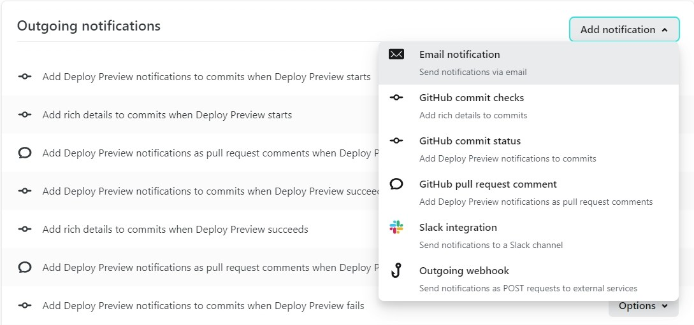

Many CI/CD services support both incoming and outgoing webhooks for the communication with external services. Also [Discord](https://discord.com/) allows the usage of webhooks to display messages — so receiving build notifications in your Discord server is totally doable! For this example I'm using [Netlify](https://www.netlify.com/) but the same steps (albeit with a different UI) also apply to other services.

You can also adapt this guide to send notifications of [GitHub Actions](/garden/running-cypress-tests-with-github-actions-in-parallel/) to a discord channel of yours.

## Step 1: Create the Discord webhook

Choose a channel on your server in which the messages should come in. Right-click on the channel => _Edit Channel_ => _Integrations_ => _Webhooks_. Click on _New Webhook_. Press the _Copy Webhook URL_ button to have the webhook URL in your clipboard.

## Step 2: Go to your CI/CD service

Visit your dashboard where you can set Notifications and add a notification of type "Slack integration":

When asked about which event it should listen to, choose the one you need. For Netlify, you could choose _Deploy succeeded_. Paste the webhook URL from your clipboard to the input for the outgoing webhook URL. Netlify calls this field _Slack Incoming Webhook URL_. You're choosing the Slack integration and not a pure webhook because the Slack notifications will be formatted and embedded as rich text.

## Step 3: Add `/slack` to the webhook URL

Discord explains in their [developer documentation](https://discord.com/developers/docs/resources/webhook#execute-slackcompatible-webhook) that you need to add `/slack` to the end of the webhook URL to receive webhook messages in the proper format.

Go to the URL input field and add `/slack` to the end of the URL. Now, go try it out and trigger a build!
