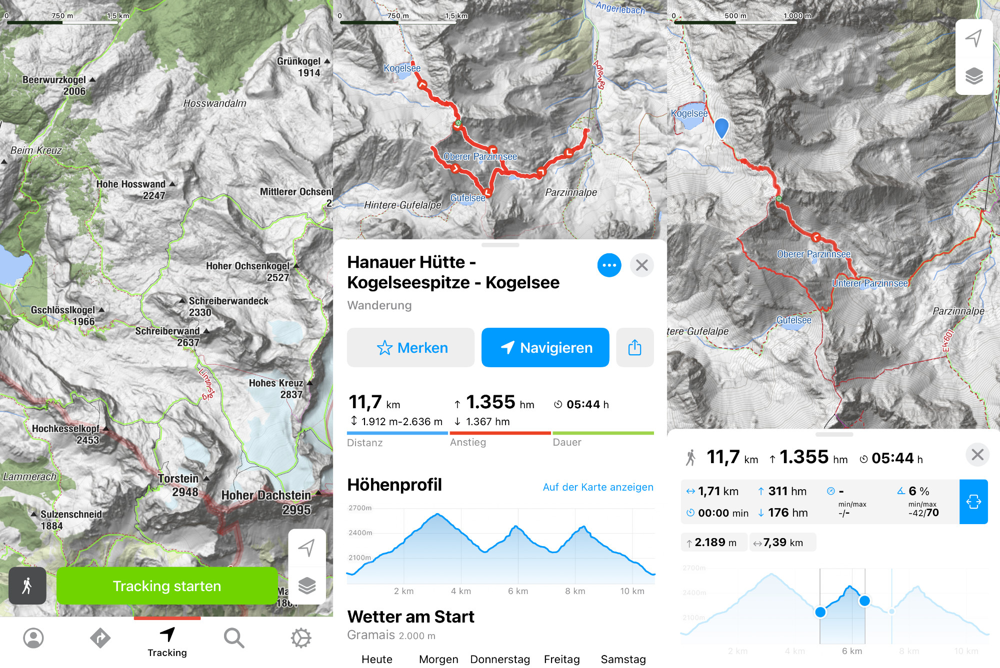
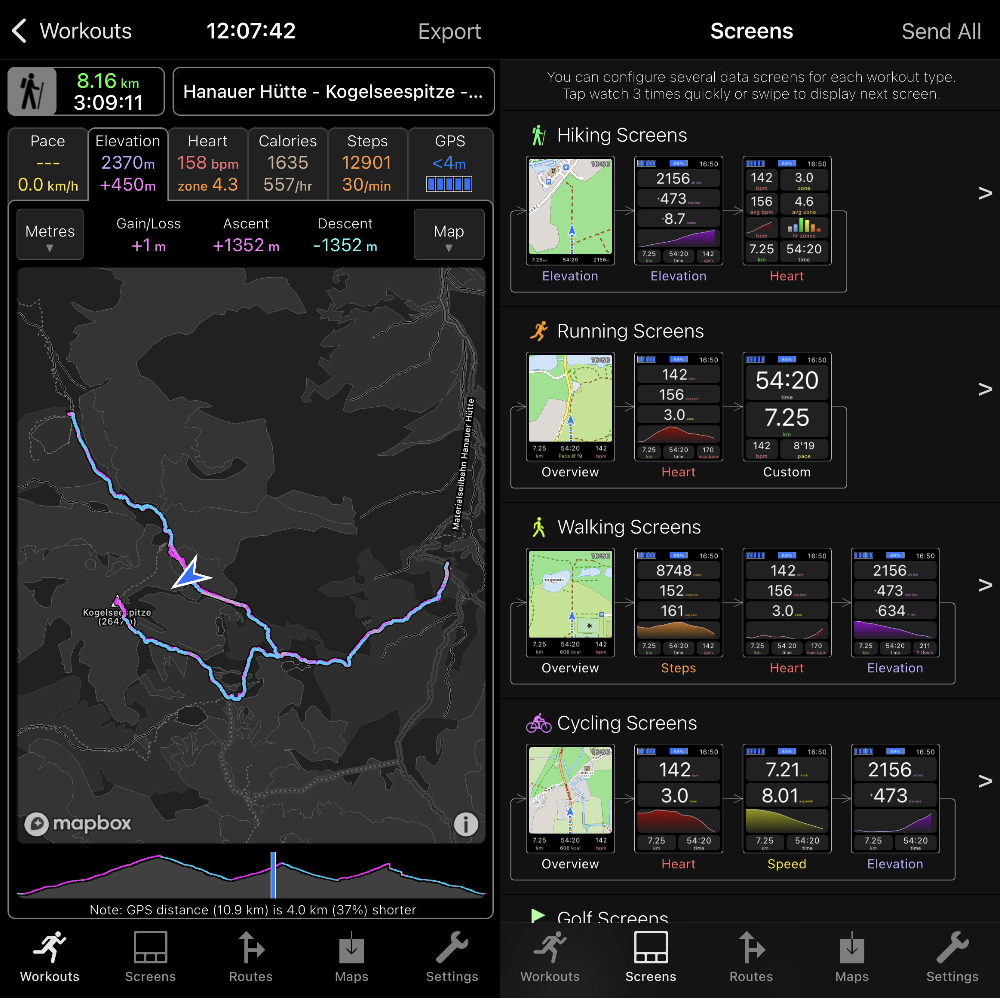

One of my favourite hobbies is to hike in the mountains (most often in the [Alps](https://en.wikipedia.org/wiki/Alps)). And of course, my iPhone and Apple Watch are also important companions in these adventures. In this short post I want to highlight my **three favourite hiking apps** that I use.

_Please note:_ I wasn't paid to mention any of these apps and it's my personal opinion. Bergfex also focuses on Europe, specifically the Alps.

## Bergfex

I'm using [Bergfex](https://www.bergfex.at/apps/) ([App Store](https://apps.apple.com/AT/app/id912776148?mt=8) / [Google Play Store](https://play.google.com/store/apps/details?id=com.bergfex.tour)) to plan my trips, look at detailed maps before and during the trip, and export tracks as GPX.

It uses OSM as its main map, but you can also purchase specialized hiking maps that e.g. local organizations publish. When browsing the map you can either create waypoints on your own or look through trips that other users already created. Similar to Komoot or Outdooractive.

The image is a collection of three typical screens you'll see in the app (from left to right):

1. General overview of the map where you can immediately start tracking. The search icon on the right indicates the existing trips from other users I mentioned above.
2. Your saved trip has a bunch of helpful information. The distance, elevation change, and estimated duration (depending on if you're beginner/intermediate/pro). It shows the elevation change in a graph (more details on this in the third image). Further below you get the latest weather forecast and the trip description.
3. When going into the detail mode of the elevation change a marker inside the map is shown. You can also view the statistic between two points instead of seeing them for the whole track.

## WorkOutDoors

WorkOutDoors ([App Store](https://apps.apple.com/de/app/workoutdoors/id1241909999)) is my standard tracker for running, hiking, and sports in general. Before a hike I import the GPX from Bergfex as a route, then during the hike I can follow the path on a map on my Apple Watch.

Most people know (and love) this app because it can show you a map on your watch during your activity. And the possibilities to modify the screens are nearly endless, you can display so many parameters. I love it!

The image is a collection of two typical screens you'll see in the app (from left to right):

1. Once you recorded a workout you can give it a name and look at it later again. It tracks the parameters: Pace, Elevation, Heart Rate, Calories, Steps, and GPS. For each parameter you can scrub along the timeline and see their individual values for that point in time of the workout. If you do running and record laps, you can also bisect the different laps. Both during the workout and afterwards color gives you an indication e.g. about the coming elevation gain/loss (pink is up, turquoise is down). From this screen you can also export the workout e.g. to Strava.
2. Each activity has a separate collection of screens that you can configure. As shown in the image, the hiking screens consist of a map (showing the elevation at the bottom), a view of current elevation, gain, loss, and chart, and lastly a screen with heart rate parameters. Each of these rows can be changed out with different values if you want.

## PhotoPills

As I often also carry my [camera](/art/photography) with me, I use [PhotoPills](https://www.photopills.com/) ([App Store](https://apps.apple.com/de/app/photopills/id596026805) / [Google Play Store](https://play.google.com/store/apps/details?id=com.photopills.android.photopills&hl=de&gl=US)) to plan a trip or evaluate a spot for future photos when I walk by it. You ask, how can you do that? The app has an amazing feature (among others):

A _Sun Planner_ screen where you can place a needle anywhere on the map, with any time and day, and then see how the sun, moon, and stars move relative to that point. An even better version of this feature is its Augmented Reality (AR) screen – this is what I most often use. Check out this video to see how it works:

<YouTube id="DVbWByV96y0" />

If you're not into photography it can still be a useful app for you to pick spots for a nice breakfast or dinner while seeing the sun go up/down.
