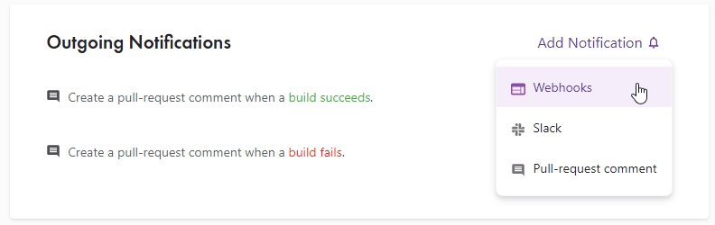
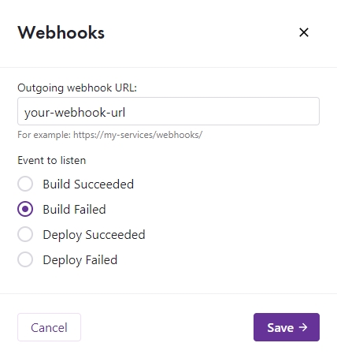
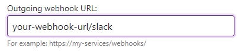

Many CI/CD services support both incoming and outgoing webhooks for the communication with external services. Also [Discord](https://discord.com/) allows the usage of webhooks to display messages -- so receiving build notifications in your Discord server is totally doable! For this example I'm using [Gatsby Cloud](https://www.gatsbyjs.com/products/cloud/) but the same steps (albeit with a different UI) also apply to services like [Netlify](https://www.netlify.com/) or [CircleCI](https://circleci.com/).

## Step 1: Create the Discord webhook

Choose a channel on your server in which the messages should come in. Right-click on the channel => _Edit Channel_ => _Integrations_ => _Webhooks_. Click on _New Webhook_. Press the _Copy Webhook URL_ button to have the webhook URL in your clipboard.

## Step 2: Go to your CI/CD service

Visit your dashboard where you can set Notifications:

Paste the webhook URL from your clipboard to the input for the outgoing webhook URL.

## Step 3: Add `/slack` to the webhook URL

Discord explains in their [developer documentation](https://discord.com/developers/docs/resources/webhook#execute-slackcompatible-webhook) that you need to add `/slack` to the end of the webhook URL to receive webhook messages in the proper format.

You can use the same webhook URL multiple times to get notifications from multiple builds into the same channel.
