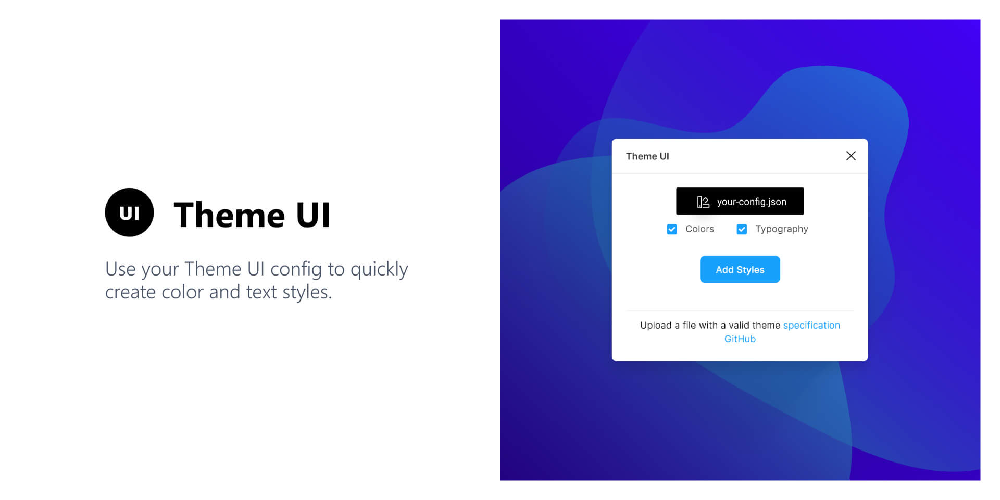
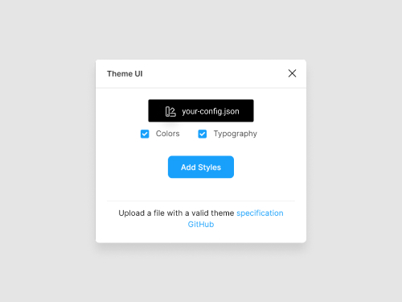

In the process of solidifying my knowledge about Svelte and TypeScript I did what most open source developers do: Solve their own problems! For many projects I use [Figma](https://www.figma.com/) in the design phase and [Theme UI](http://theme-ui.com/) as the styling library for the project. I often times start with an implementation of the TailwindCSS config (colors, spacing, etc.) and modify it to the individual project's needs. Out of this comes an already finished Theme UI theme file.

To be able to import this theme file into Figma and automatically create color & text styles I created a new plugin for Figma!

Introducing the [Theme UI plugin for Figma](https://www.figma.com/community/plugin/797015796747379907/Theme-UI) 🎉



You can install the plugin directly in Figma via the Community hub. Since the plugin is still in its early stages I'd appreciate feedback or contributions to the plugin itself. The source code is on GitHub: https://github.com/LekoArts/figma-theme-ui

## How a typical workflow looks like

So, what even is Theme UI? For me personally it's a great abstraction on top of existing CSS-in-JS styling solutions. Using plain Emotion still enabled me to get into bad habits of e.g. using different CSS for things that actually should look the same / feel consistent. Designing with constraints -- but still being able to break out of those in one-off cases -- is a huge step forward in creating interfaces more quickly and coherent. I think the [motivation docs](https://theme-ui.com/guides/motivation/) also phrase it in a clear way:

> One of the primary motivations behind Theme UI is to make building themeable, constraint-based user interfaces in React as simple and as interoperable as possible. [...] While some of the ideas encapsulated within this library may seem familiar, the intent here is to combine modern CSS tooling into a single "mini-framework" with good guidance on how to fall into the pit of success for creating white-label products, themed component libraries, and even full websites.

### Creating a theme file

You should begin by creating a theme file in JavaScript with a default export in the `module.exports` syntax. It can be as minimal as:

```js title=index.js
module.exports = {
  space: [0, 4, 8, 16, 32, 64],
  fonts: {
    body: '-apple-system, BlinkMacSystemFont,"Segoe UI",Roboto,"Helvetica Neue",Arial,"Noto Sans",sans-serif,"Apple Color Emoji","Segoe UI Emoji","Segoe UI Symbol","Noto Color Emoji"',
    heading: "inherit",
  },
  fontSizes: [12, 14, 16, 20, 24, 32],
  fontWeights: {
    body: 400,
    heading: 700,
  },
  lineHeights: {
    body: 1.5,
    heading: 1.125,
  },
  colors: {
    text: "#000",
    background: "#fff",
    brand: {
      primary: "#07c",
      secondary: "#30c",
    },
    teal: [null, "#e6fffa", "#b2f5ea", "#81e6d9"],
  },
};
```

Save the file as `index.js` somewhere (e.g. in your React project where you use Theme UI). The content is from [an example config](https://github.com/LekoArts/figma-theme-ui/blob/master/example-config.js). The theme file itself can be extended of course, following the [official spec](https://theme-ui.com/theme-spec/).

<Alert status="info" title="Note">
  You need to make sure to use `module.exports` syntax and no other content than
  the config is allowed in the file. Otherwise the Figma plugin has problems
  parsing your config.
</Alert>

### Using the Figma plugin

If you haven't done so, you can install the plugin in the community tab: [Theme UI plugin for Figma](https://www.figma.com/community/plugin/797015796747379907/Theme-UI). Or find it via the search.

Open the plugin by doing a _Right click_ => _Plugins_ => _Theme UI_.


The only option in the initial window is pressing the "Upload config" button. Choose the `index.js` file you created in the previous step. When it successfully loaded you'll be able to toggle two options:



Toggling the _Colors_ and _Typography_ checkboxes enables you to conditionally convert the config to Figma styles. After pressing the "Add Styles" button the window will close and you see the new styles on the right sidebar:


## The future of the plugin

You might (rightfully) say now: "But wait, this only works in one direction!". And that's true as the plugin currently only works by providing a Theme UI config file and putting that into Figma. The other way around of exporting a Theme UI file from Figma styles is in the initial release not available.

But I see great value in adding this workflow! You can follow the [issue describing this request](https://github.com/LekoArts/figma-theme-ui/issues/16) to see when it's done 😊

Besides that I'd appreciate any feedback you might have (you can post an issue or contact me on [Twitter](https://www.twitter.com/lekoarts_de)) and would be happy to review PRs that implement or fix something you saw.
