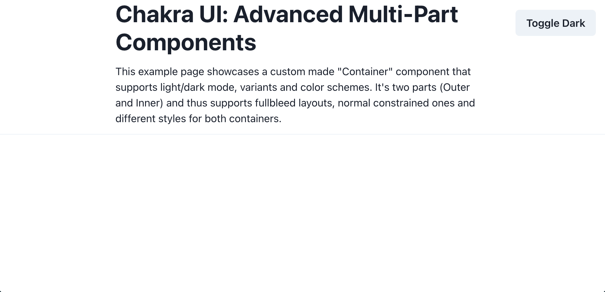
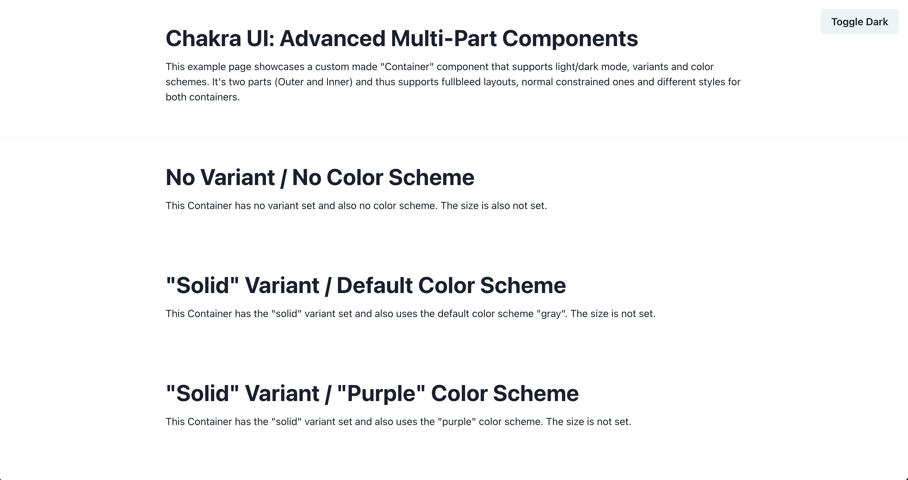

## Introduction

[Chakra UI](https://chakra-ui.com/) is a modular and accessible component library that has won the hearts of many developers. I personally really like its progressive disclosure of complexity for the APIs (theming, components, helper functions). Often times you'll find yourself modifying some theme properties like colors and sticking with the components it ships with. However, you can use [component styles](https://chakra-ui.com/docs/theming/component-style) to change individual components to your liking. This allows you to change base & default styles but also add new styles to a component and modify properties like size, variant, color scheme, and color mode behavior.

But what if you want to create your own component that fits into the existing project and uses the underlying theming system? No problem, you can also use component styles for that. Even if the component has multiple components to it (multipart). While the component styles API certainly has a learning curve to it, the time learning it will be worth your time. Your components will behave the same as any other component which greatly improves productivity for you (and possibly your team) and ensures consistency in your project.

By the end of this tutorial, you'll be able to create a multipart component in Chakra UI that is controllable by variant, size, color schemes and respects the color mode. You'll create a _Container_ component that you can use to display your main content (e.g. an article like this) or full-bleed content. [See the live preview](https://chakra-ui-advanced-components.netlify.app/).

<Alert status="info" title="Intended audience">

This tutorial assumes that you have used Chakra UI in the past or are familiar with its usage, especially how you use themes and different modifiers like size, variant, etc. I'd suggest following their [getting started guide](https://chakra-ui.com/docs/getting-started) or browsing their [resources](https://chakra-ui.com/resources) to learn the basics.

You'll use [Vite](https://vitejs.dev/) to build the demo site but no prior knowledge is necessary.

</Alert>

## Theming System

To get started, create a project with [Vite](https://vitejs.dev/) using the `react-ts` preset. Initialize a project in your preferred directory with:

```shell
npm init vite
```

You'll be asked three questions:

```shell
~ > npm init vite
✔ Project name: your-project-name
✔ Select a framework: › react
✔ Select a variant: › react-ts
```

Go into `your-project-name` directory and run `npm install`. To install all necessary Chakra UI packages for this tutorial, run the following:

```shell
npm install @chakra-ui/react @chakra-ui/theme-tools @emotion/react@^11 @emotion/styled@^11 framer-motion@^4
```

You've successfully set up the boilerplate for this tutorial! In the next steps you'll also create the baseline for Chakra UI by adding a provider, creating a theme and using one of Chakra UI's built-in components.

Go into `src/main.tsx` to wrap the `<App />` with the Chakra UI Provider:

```ts title=src/main.tsx {3,5,9-11}
import React from "react"
import ReactDOM from "react-dom"
import { ChakraProvider } from "@chakra-ui/react"
import App from "./App"
import theme from "./theme"

ReactDOM.render(
  <React.StrictMode>
    <ChakraProvider theme={theme}>
      <App />
    </ChakraProvider>
  </React.StrictMode>,
  document.getElementById("root")
)
```

The `theme` doesn't exist yet so create a new file at `src/theme.ts`. By default, Chakra UI ships with a [default theme](https://chakra-ui.com/docs/theming/theme) that you can [customize](https://chakra-ui.com/docs/theming/customize-theme). For the purposes of this tutorial you'll use customized CSS media query breakpoints and define the default CSS `prefers-color-scheme` to the `light` variant (+ use the system setting to switch between light and dark mode):

```ts title=src/theme.ts
import { extendTheme, ThemeConfig } from "@chakra-ui/react"

const breakpoints = {
  sm: "640px",
  md: "768px",
  lg: "1024px",
  xl: "1280px",
  "2xl": "1536px",
})

const config: ThemeConfig = {
  initialColorMode: "light",
  useSystemColorMode: true,
}

const theme = extendTheme({
  breakpoints,
  config,
})

export default theme
```

By using `extendTheme` you only overwrite the properties you define, the rest will be the default theme.

<Alert status="info" title="Organizing the theme file">

It's a good idea to split out the properties going into `extendTheme` if your theme file itself gets to large. Chakra UI documents this process here: [Scaling out your project](https://chakra-ui.com/docs/theming/customize-theme#scaling-out-your-project).

</Alert>

Before customizing the built-in `Container` component, you should first use it on the index page to visually see the changes you make. Add a color mode toggle to also test out the two different color modes:

```tsx title=src/App.tsx
import React from "react"
import {
  Container,
  useColorMode,
  Button,
  Heading,
  Text,
  Divider,
} from "@chakra-ui/react"

function App() {
  const { colorMode, toggleColorMode } = useColorMode()

  return (
    <main>
      <Button
        position="fixed"
        right="1rem"
        top="1rem"
        onClick={toggleColorMode}
      >
        Toggle {colorMode === "light" ? "Dark" : "Light"}
      </Button>
      <Container>
        <Heading as="h1">Chakra UI: Advanced Multi-Part Components</Heading>
        <Text sx={{ mt: 3, mb: 3 }}>
          This example page showcases a custom made "Container" component that
          supports light/dark mode, variants and color schemes. It's two parts
          (Outer and Inner) and thus supports full bleed layouts, normal
          constrained ones and different styles for both containers.
        </Text>
      </Container>
      <Divider />
    </main>
  )
}

export default App
```

Start Vite to see it in action:

```shell
npm run dev
```

Go to `http://localhost:3000` and you should see something like this:



## Customizing Container

As the `MultiContainer` should reuse some styles from `Container` you'll first need to modify the built-in `Container` component. Chakra UI has a specific theming API for its [component styles](https://chakra-ui.com/docs/theming/component-style) that follows this shape:

```js
export default {
  // Styles for the base style
  baseStyle: {},
  // Styles for the size variations
  sizes: {},
  // Styles for the visual style variations
  variants: {},
  // The default `size` or `variant` values
  defaultProps: {},
}
```

Create a new file at `src/chakra/container.ts` with the following contents:

```ts title=src/chakra/container.ts
import { ComponentStyleConfig } from "@chakra-ui/react"

const Container: ComponentStyleConfig = {
  baseStyle: {
    w: "100%",
    mx: "auto",
    maxW: "960px",
    px: [4, 6],
    py: [8, 10],
  },
  defaultProps: {
    colorScheme: "gray",
  },
}

export default Container
```

This means that every instance of `<Container />` has the `baseStyle` and the `colorScheme` of `gray` by default. But only creating the file doesn't do anything yet, you'll need to tell Chakra UI to use this file for `Container` now. You do this by passing overwrites for built-in components and also files for new components into the `components` key of the `extendTheme` function:

```ts title=src/theme.ts {2,18-20}
import { extendTheme, ThemeConfig } from "@chakra-ui/react"
import Container from "./chakra/container"

const breakpoints = {
  sm: "640px",
  md: "768px",
  lg: "1024px",
  xl: "1280px",
  "2xl": "1536px",
}

const config: ThemeConfig = {
  initialColorMode: "light",
  useSystemColorMode: true,
}

const theme = extendTheme({
  components: {
    Container,
  },
  breakpoints,
  config,
})

export default theme
```

Switch to your browser window running `http://localhost:3000` now to see the visual change. The heading and paragraph has a padding around it now and the `max-width` is wider.

<Alert status="success" title="What you just learned">

Hooray, you just modified one of Chakra UI's built-in components! To recap, what you just learned:

- Setting up Vite and Chakra UI
- Chakra UI uses a `theme` for its provider. Create a file with an export using the `extendTheme` function to set new values and overwrite default ones
- Component styles have a dedicated theming API and you can use `baseStyle`, `sizes`, `variants`, and `defaultProps` to extend/overwrite existing components and define completely new components

</Alert>

## Creating MultiContainer

Okay, ready to dive deeper into the component style API? Great! Since this is a brand new, custom component there are three things you'll need to do:

1. Create a file defining the React component
1. Create a file defining the component styles
1. Adding the component style to `extendTheme`

After that you'll be able to use the `<MultiContainer />` component in your app.

### Defining the React Component

Since `MultiContainer` is not a built-in component a React component that consumes the styles is needed. For this you can use the `useStyleConfig` and `useMultiStyleConfig` React hooks. Create a file at `src/components/multi-container.tsx`:

```tsx title=src/components/multi-container.tsx
import * as React from "react"
import { useMultiStyleConfig, Box, Container, BoxProps } from "@chakra-ui/react"

interface IMultiContainerProps extends BoxProps {
  variant?: "solid" | "gradient" | "ghost" | undefined
  colorScheme?: string
  size?: "prose" | "1/4" | "2/4" | "3/4" | "full"
}

const MultiContainer: React.FC<IMultiContainerProps> = ({
  variant = undefined,
  colorScheme = undefined,
  size = undefined,
  children,
  ...rest
}) => {
  const styles = useMultiStyleConfig(`CustomContainer`, {
    variant,
    colorScheme,
    size,
  })

  return (
    <Box __css={{ ...styles.outer }} {...rest}>
      <Container sx={{ ...styles.inner }}>{children}</Container>
    </Box>
  )
}

export default MultiContainer
```

I'd like to start off by defining the React component as this defines the public facing API that a user will interact with. Based off on this the creation of the component style is easier in my experience.

<Collapsible summary={<em>Detailed look at MultiContainer component</em>}>

For a multipart component you can define as many parts as you want. In this case it's `outer` and `inner`. The `IMultiContainerProps` TypeScript type restricts the public API that the component will have and is a good guidance for the work that still needs to be done.

By using `CustomContainer` in the `useMultiStyleConfig` hook you defined the name of the component you'll pass to `extendTheme`. The hook returns the styles for each part you declared in the component style.

Essentially the `MultiContainer` component is a wrapper around the existing `Container` component so that you can create full bleed containers and different styles between the outer and inner part. The `<Box />` component is a generic component provided by Chakra UI that accepts all valid props. The `outer` styles are passed to the prop `__css`. It has the same API as the `sx` prop, but has a lower style priority. This means you can override the style properties with Chakra style props.

</Collapsible>

<Alert status="success" title="What you just learned">

You can leverage the `useStyleConfig` and `useMultiStyleConfig` React hooks to access component styles you defined and use the information in your React components however you like. When accessing the component styles the `variant`, `colorScheme` and `size` can be passed along.

</Alert>

### Defining the Component Styles

Create a new file at `src/chakra/custom-container.ts`. You'll notice that the shape of the config differs a little bit -- for multipart components a new top-level `parts` key is needed and each part is a key inside `baseStyle`, `sizes`, `variants`, and `defaultProps`:

```ts title=src/chakra/custom-container.ts
import { ComponentStyleConfig } from "@chakra-ui/react"

const CustomContainer: ComponentStyleConfig = {
  parts: ["outer", "inner"],
  baseStyle: {
    outer: {},
    inner: {},
  },
  variants: {
    solid: (props) => ({
      outer: {},
    }),
    ghost: (props) => ({
      outer: {},
      inner: {},
    }),
    gradient: (props) => ({
      outer: {},
    }),
  },
  sizes: {
    prose: {
      inner: {},
    },
    // Percentage-based widths for "inner" part
  },
  defaultProps: {
    colorScheme: "gray",
  },
}

export default CustomContainer
```

<Alert status="info" title="Pro Tip: Reading Source Code">

The way I figured out the styles for multipart components and all the content below is by reading the source code of Chakra UI. In there, you can find really comprehensive examples like the [Button component](https://github.com/chakra-ui/chakra-ui/blob/5f9038b3f7479f1c0afd527ca6c9e5f64190af93/packages/theme/src/components/button.ts).

</Alert>

The file already contains the `variants` and `sizes` defined in the `MultiContainer` component. Each configuration inside a `outer` will go to the outer `<Box />`, each `inner` styles will go to the inner `<Container />`.

Let's wire up the custom component into the app so that you can see the changes made to the component style. Edit the `theme`:

```ts title=src/theme.ts {10}
// Existing imports
// ...
import CustomContainer from "./chakra/custom-container"

// Existing configuration
// ...
const theme = extendTheme({
  components: {
    Container,
    CustomContainer,
  },
  breakpoints,
  config,
})
```

Edit the `src/App.tsx` to showcase some different variants & sizes of the `MultiContainer` component:

```tsx title=src/App.tsx
import React from "react"
import {
  Container,
  useColorMode,
  Button,
  Heading,
  Text,
  Divider,
} from "@chakra-ui/react"
import MultiContainer from "./components/multi-container"

function App() {
  const { colorMode, toggleColorMode } = useColorMode()

  return (
    <main>
      <Button
        position="fixed"
        right="1rem"
        top="1rem"
        onClick={toggleColorMode}
      >
        Toggle {colorMode === "light" ? "Dark" : "Light"}
      </Button>
      <Container>
        <Heading as="h1">Chakra UI: Advanced Multi-Part Components</Heading>
        <Text sx={{ mt: 3, mb: 3 }}>
          This example page showcases a custom made "Container" component that
          supports light/dark mode, variants and color schemes. It's two parts
          (Outer and Inner) and thus supports full bleed layouts, normal
          constrained ones and different styles for both containers.
        </Text>
      </Container>
      <Divider />
      <MultiContainer>
        <Heading as="h2">No Variant / No Color Scheme</Heading>
        <Text sx={{ mt: 3, mb: 3 }}>
          This Container has no variant set and also no color scheme. The size
          is also not set.
        </Text>
      </MultiContainer>
      <MultiContainer variant="solid">
        <Heading as="h2">"Solid" Variant / Default Color Scheme</Heading>
        <Text sx={{ mt: 3, mb: 3 }}>
          This Container has the "solid" variant set and also uses the default
          color scheme "gray". The size is not set.
        </Text>
      </MultiContainer>
      <MultiContainer variant="solid" colorScheme="purple">
        <Heading as="h2">"Solid" Variant / "Purple" Color Scheme</Heading>
        <Text sx={{ mt: 3, mb: 3 }}>
          This Container has the "solid" variant set and also uses the "purple"
          color scheme. The size is not set.
        </Text>
      </MultiContainer>
      <MultiContainer variant="ghost" colorScheme="blue">
        <Heading as="h2">"Ghost" Variant / "Blue" Color Scheme</Heading>
        <Text sx={{ mt: 3, mb: 3 }}>
          This Container has the "ghost" variant set and also uses the "blue"
          color scheme. The size is not set.
        </Text>
      </MultiContainer>
      <MultiContainer variant="gradient" colorScheme="orange">
        <Heading as="h2">"Gradient" Variant / "Orange" Color Scheme</Heading>
        <Text sx={{ mt: 3, mb: 3 }}>
          This Container has the "gradient" variant set and also uses the
          "Orange" color scheme. The size is not set.
        </Text>
      </MultiContainer>
      <MultiContainer size="prose">
        <Heading as="h2">No Variant / No Color Scheme / "Prose" Size</Heading>
        <Text sx={{ mt: 3, mb: 3 }}>
          This Container has no variant set and also no color scheme. The size
          is set to "prose".
        </Text>
      </MultiContainer>
      <MultiContainer variant="ghost" size="3/4">
        <Heading as="h2">
          "Ghost" Variant / No Color Scheme / "3/4" Size
        </Heading>
        <Text sx={{ mt: 3, mb: 3 }}>
          This Container has the "ghost" variant set and also no color scheme.
          The size is set to "3/4" which equals 75%.
        </Text>
      </MultiContainer>
    </main>
  )
}

export default App
```

When going back to `http://localhost:3000` you should see new entries but they don't look different right now:



Time to change that!

Edit the component style to lay out some baseline config:

```ts title=src/chakra/custom-container.ts {2-3,8-14,22,31-36}
import { ComponentStyleConfig } from "@chakra-ui/react"
import InnerContainerStyles from "./container"
import { percentageWidths } from "./utils"

const CustomContainer: ComponentStyleConfig = {
  parts: ["outer", "inner"],
  baseStyle: {
    outer: {
      w: "100%",
      margin: 0,
    },
    inner: {
      ...InnerContainerStyles.baseStyle,
    },
  },
  variants: {
    solid: (props) => ({
      outer: {},
    }),
    ghost: (props) => ({
      outer: {
        py: [8, 10],
      },
      inner: {},
    }),
    gradient: (props) => ({
      outer: {},
    }),
  },
  sizes: {
    prose: {
      inner: {
        maxW: "65ch",
      },
    },
    ...percentageWidths(4, "inner"),
  },
  defaultProps: {
    colorScheme: "gray",
  },
}

export default CustomContainer
```

The `percentageWidths` function inside `utils` doesn't exist yet. Create a new file at `src/chakra/utils.ts`:

```ts title=src/chakra/utils.ts withLineNumbers
export function percentageWidths(
  divisions: number,
  part: string,
  property = "maxW"
) {
  let result: Record<typeof part, any> = {}
  for (let i = 1; i <= divisions; i++) {
    const name = i === divisions ? "full" : `${i}/${divisions}`
    const w = Number((i / divisions) * 100).toFixed(4)
    result[name] = {
      [part]: {
        [property]: `${+w}%`,
      },
    }
  }
  return result
}
```

<Collapsible summary={<em>Detailed look at percentageWidths</em>}>

The function can take three arguments: `divisions`, `part`, and `property`. In the component style it's used with `4` and `"inner"` (so for `property` it falls back to `maxW`). At the end an object is returned that can be spread into the component style.

The for-loop is 1-indexed (and not zero-indexed as usual) so that for `4` divisions the `name` starts with `"1/4"`. For the case `"4/4"` the name `full` should be used instead. `w` is calculated by first dividing `i` with `divisions` and then multiplying it by `100` to make it a percentage. Using `Number()` you're casting it to a number so that you can round the value with `.toFixed(4)`. In line 10 the empty `result` object is directly mutated for each iteration in the for-loop. Only when the for-loop is finished the now filled `result` object is returned.

</Collapsible>

The goal of the function is to return an object in the following shape. It's then _spread_ into the `sizes` component style. This allows the usage of e.g. `size="1/4"` on the React component.

```js
{
  "1/2": {
    "inner": {
      "maxW": "50%"
    }
  },
  "full": {
    "inner": {
      "maxW": "100%"
    }
  }
}
```

If you now go back to `http://localhost:3000` and look at the bottom two entries you'll see that their `max-width` changed. Awesome!

## Defining Variants

Now we're getting to the most exciting part of this tutorial! It'll be more complicated than the previous sections but don't worry, you got this 👍🏻

The `variants` option of a component is really the most powerful one as you can do so much with the information you get: theme, color schemes, and color modes.

### Solid

Let's start with the `solid` variant. Goal of it is to make both `outer` and `inner` a solid color by using the colors in Chakra UI's default theme.

Edit the `utils` file:

```ts title=src/chakra/utils.ts
import {
  mode,
  transparentize,
  getColor,
  StyleFunctionProps,
} from "@chakra-ui/theme-tools"

type AccessibleColor = {
  bg?: string
  color?: string
}

/** Accessible color overrides for less accessible colors. */
export const accessibleColorMap: { [key: string]: AccessibleColor } = {
  yellow: {
    bg: "yellow.400",
    color: "black",
  },
  cyan: {
    bg: "cyan.400",
    color: "black",
  },
}

export function variantSolid(props: StyleFunctionProps) {
  const { colorScheme: c } = props

  if (!c) {
    return {}
  }

  if (c === "gray") {
    return {
      bg: mode(`gray.100`, `whiteAlpha.200`)(props),
    }
  }

  const { bg = `${c}.500`, color = "white" } = accessibleColorMap[c] || {}

  return {
    bg: mode(bg, `${c}.200`)(props),
    color: mode(color, `gray.800`)(props),
  }
}

// Rest of existing functions
// ...
```

<Collapsible summary={<em>Detailed look at variantSolid</em>}>

Inside each modifier style you can use an object to define the style or a function that returns an object. Throughout the component style for `CustomContainer` the function syntax was used as this allows access to `props`. This way you can get this information:

- `colorScheme`
- `colorMode`
- `orientation`
- `theme`

Which is excellent to create a reusable function that can consider all of the above. So `props` from `solid: (props) => ()` goes into `variantSolid`. As `gray` was defined as the default `colorScheme` no early return will happen.

The `mode('light-mode value', 'dark-mode value')(props)` function is a helper from Chakra UI and allows one to access the theme in dot notation and setting the value depending on the current color mode (light or dark mode).

This line is also interesting:

```js
const { bg = `${c}.500`, color = "white" } = accessibleColorMap[c] || {}
```

If the `colorScheme` is `yellow` or `cyan` the values from `accessibleColorMap` should be used. Otherwise use `${c}.500` for the `bg` and `white` for `color`. This ensures good contrast for text on otherwise too light background.

</Collapsible>

With this new function, edit the component style:

```ts title=src/chakra/custom-container.ts
// Existing imports
// ...
import { variantSolid, percentageWidths } from "./utils"

// Existing component style
// ...
solid: (props) => ({
  outer: variantSolid(props),
}),
```

Check `http://localhost:3000` to see the second and third section working 🎉

### Ghost

Next up is the `ghost` variant. With this the `outer` part has a solid color, the `inner` part has a slightly transparent, lighter color. So you'll be able to clearly see the borders of the `inner` part.

Edit the `utils` file:

```ts title=src/chakra/utils.ts
// Existing imports
// ...

// Rest of existing functions
// ...

export function variantGhost(props: StyleFunctionProps) {
  const { colorScheme: c, theme } = props

  if (c === "gray") {
    return {
      color: mode(`inherit`, `whiteAlpha.900`)(props),
      bg: mode(`gray.100`, `whiteAlpha.200`)(props),
    }
  }

  const transparentBgDark = transparentize(`${c}.200`, 0.12)(theme)
  const transparentBgLight = transparentize(`${c}.50`, 0.8)(theme)

  return {
    color: mode(`${c}.600`, `${c}.100`)(props),
    bg: mode(transparentBgLight, transparentBgDark)(props),
  }
}

export function variantGhostOuter(props: StyleFunctionProps) {
  const { colorScheme: c } = props

  if (c === "gray") {
    return {
      color: mode(`inherit`, `whiteAlpha.900`)(props),
      bg: mode(`gray.50`, `whiteAlpha.200`)(props),
    }
  }

  return {
    color: mode(`${c}.600`, `${c}.200`)(props),
    bg: mode(`${c}.200`, `${c}.900`)(props),
  }
}
```

The functionality is split up into two functions as the `inner` part needs some transparency for the background. For this the `transparentize('color-string', alpha)(theme)` helper function from Chakra UI is used. Since `gray` is a special case, an early return with different values is given. Otherwise these functions are quite similar to the `variantSolid` function.

To add the new functionality, edit your component style:

```ts title=src/chakra/custom-container.ts
// Existing imports
// ...
import {
  variantSolid,
  variantGhost,
  variantGhostOuter,
  percentageWidths,
} from "./utils"

// Existing component style
// ...
ghost: (props) => ({
  outer: {
    ...variantGhostOuter(props),
    py: [8, 10],
  },
  inner: variantGhost(props),
}),
```

### Gradient

And last, but not least: The `gradient` variant. This one is a bit trickier since the `mode()` helper function unfortunately can't really help here and you'll need to write a bit more verbose code:

Edit the `utils` file:

```ts title=src/chakra/utils.ts
// Existing imports
// ...

// Rest of existing functions
// ...

export function variantGradient(props: StyleFunctionProps) {
  const { colorScheme: c, colorMode, theme } = props
  const isDarkMode = colorMode === "dark"

  if (!c) {
    return {}
  }

  if (c === "gray") {
    const topColor = isDarkMode
      ? getColor(theme, `${c}.700`)
      : getColor(theme, `${c}.100`)
    const bottomColor = isDarkMode
      ? getColor(theme, `${c}.900`)
      : getColor(theme, `${c}.300`)

    return {
      bg: `linear-gradient(0deg, ${bottomColor} 0%, ${topColor} 100%)`,
    }
  }

  const topColor = isDarkMode
    ? getColor(theme, `${c}.700`)
    : getColor(theme, `${c}.100`)
  const bottomColor = isDarkMode
    ? getColor(theme, `${c}.900`)
    : getColor(theme, `${c}.300`)

  return {
    bg: `linear-gradient(0deg, ${bottomColor} 0%, ${topColor} 100%)`,
  }
}
```

The major difference between `variantGradient` and the rest is that instead of relying on `mode()` to use the current `colorMode` to decide the color, for gradients you'll need to write this ternary yourself every time. With the `getColor(theme, 'color-string')` helper function you can get the actual value out of the theme using the dot notation (instead of directly reaching into `theme`).

Maybe some day Chakra UI will add some convenience methods around gradients (with support for `colorMode`). Anyways, edit the final variant:

```ts title=src/chakra/custom-container.ts
// Existing imports
// ...
import {
  variantSolid,
  variantGhost,
  variantGhostOuter,
  percentageWidths,
  variantGradient,
} from "./utils"

// Existing component style
// ...
gradient: (props) => ({
  outer: variantGradient(props),
}),
```

And you're done with all options for `MultiContainer` 🎉 You now have a fully functional multipart Chakra UI component that takes the current color mode into account and can be controlled by size and color scheme.

<Alert status="success" title="What you just learned">

When defining modifier styles for a component you can not only write it as an object but also as a function `(props) => ({})` which gives you full access to values like `colorMode` or `theme`. You've then written utility functions to generate the styles for three variants: `solid`, `ghost`, and `gradient`. Using helper functions from `@chakra-ui/theme-tools` you created accessible variants leveraging the color mode and respecting the current color mode.

</Alert>

## Next steps

Congrats on finishing the tutorial, you can find the code for the finished project [on GitHub](https://github.com/LekoArts/chakra-ui-advanced-multipart-components). But what now? Where could you go next?

In this tutorial you created a multipart component consisting of two parts that interact rather simple with each other. I wanted to focus on the techniques and code to integrate all possible options into the `variants`. Think of a component like a menu that consists of more than two parts and create a multipart component out of it. It'll help if you read the [source code](https://github.com/chakra-ui/chakra-ui/blob/5f9038b3f7479f1c0afd527ca6c9e5f64190af93/packages/theme/src/components/menu.ts) on such components.

You could also try to publish your component as its own npm package (see [official documentation](https://chakra-ui.com/docs/theming/advanced#distributing-a-theme-package)) or add [theme typings](https://chakra-ui.com/docs/theming/advanced#theme-typings).

**Did you build something cool with this guide?** Please share it with me on Twitter at [@lekoarts_de](https://twitter.com/lekoarts_de) as I'm eager to see more multipart components in the wild!
