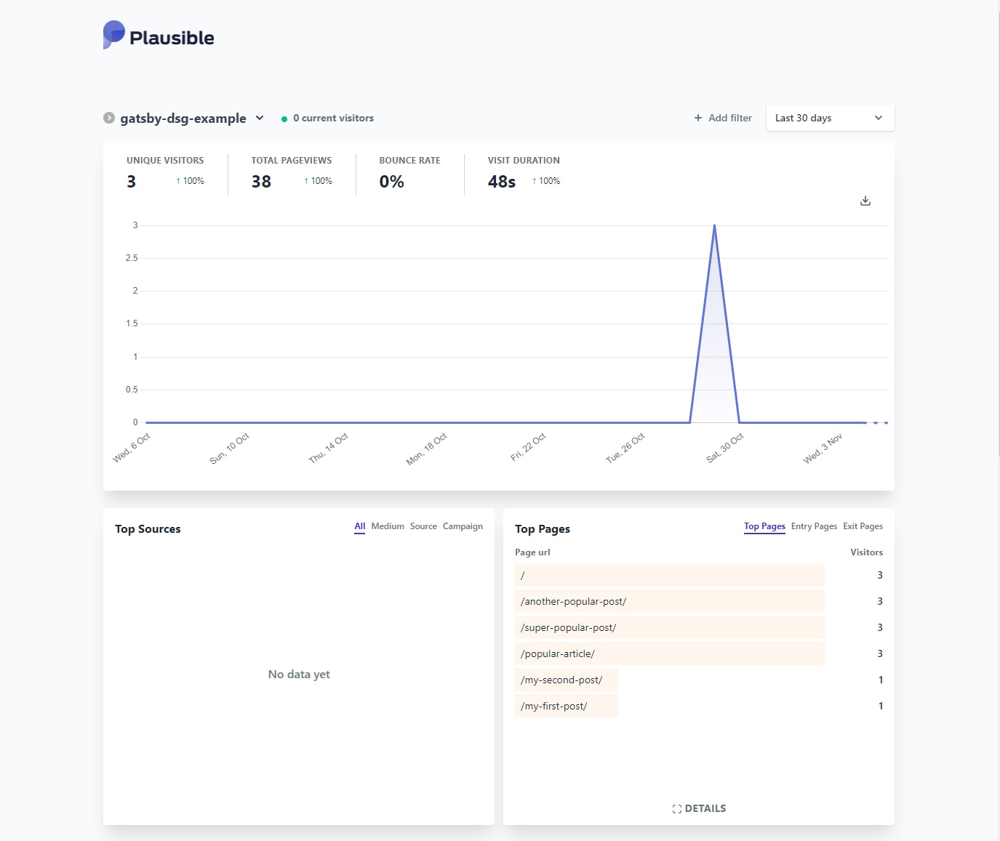
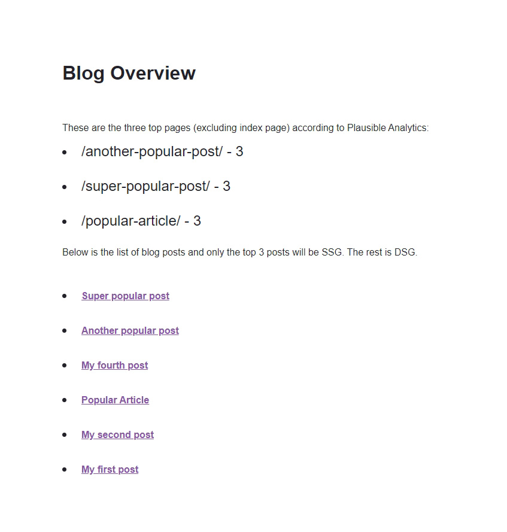
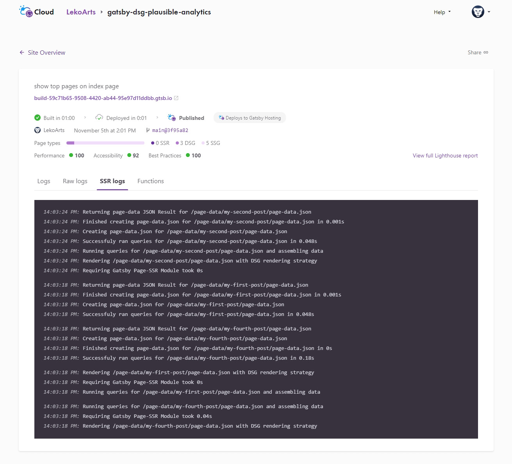

Context: What are you talking about?
Relevance: Why should I care about that?
Application: How do it do it?

Learning goals => Assessment => Lesson Plan

## Introduction

Gatsby 4 introduced a lot of new features, most notably the introduction of additional rendering options besides Static Site Generation (SSG): Deferred Static Generation (DSG) and Server-Side Rendering (SSR). If you missed this exciting release you can catch up in the blog post [What's New in Gatsby 4](https://www.gatsbyjs.com/blog/whats-new-in-gatsby-4/) after following this tutorial.

So why should you care about Deferred Static Generation? In a nutshell it delays (or defers) the generation of pages until a user actually requests the page. After that the build artifacts (HTML & JSON) are cached at the CDN level and for all visitors afterwards it behaves like a normal SSG page. In a scenario where you build thousands of pages but only a subset of them gets regular visits from users, DSG can dramatically improve your build speeds. And you still get the SSG benfits like great SEO, speed, and reliability.

In choosing what pages to defer you can improve your page on a granular and individual level -- but for how you'd do this the sky is really the limit. In this tutorial I'll explain how you can use data from your analytics tool (like Google Analytics, [Plausible Analytics](https://plausible.io), [Fathom](https://usefathom.com/), etc.) to programmatically defer pages that are not popular, only building your top pages as SSG. By the end of this tutorial, you'll be able to create a source plugin for your analytics tool (if it doesn't exist yet) and use that data to defer pages in your site.

<Alert status="info" title="Prerequisites">

If you want to follow this tutorial step-by-step you'll need to have a couple of accounts for the online platforms in this guide. You need to have a [GitHub account](https://github.com/join) and you'll deploy your site to [Gatsby Cloud](https://www.gatsbyjs.com/products/cloud/) so you also need an [account](https://www.gatsbyjs.com/dashboard/signup/) there. Both accounts are free.

Since I'm personally a big fan of [Plausible Analytics](https://plausible.io) this tutorial will use this specific analytics tool. You can't create a free account there (but start a 30 day trial), so if you need something free you can use Google Analytics.

If you haven't set up your development environment yet, you can follow [Part 0 of the official Gatsby tutorial](https://www.gatsbyjs.com/docs/tutorial/part-0/) to do so.

</Alert>

## Adding Plausible Analytics to Your Site

- Collapsible: Use other analytics tools

<Collapsible summary={<em>Not using Plausible Analytics?</em>}>

foobar

</Collapsible>

## Creating A Source Plugin

## Deferring Low-Traffic Pages

## Deploying to Gatsby Cloud

## Next Steps
