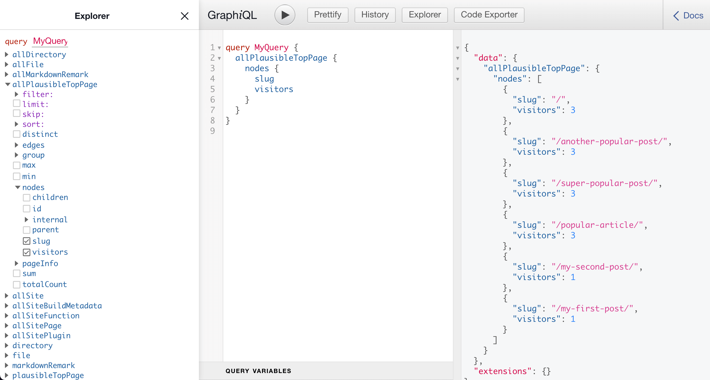

## Introduction

Gatsby 4 introduced a lot of new features, most notably the introduction of additional rendering options besides Static Site Generation (SSG): Deferred Static Generation (DSG) and Server-Side Rendering (SSR). If you missed this exciting release you can catch up in the blog post [What's New in Gatsby 4](https://www.gatsbyjs.com/blog/whats-new-in-gatsby-4/) after following this tutorial.

So why should you care about Deferred Static Generation? In a nutshell it delays (or defers) the generation of pages until a user actually requests the page. After that the build artifacts (HTML & JSON) are cached at the CDN level and for all visitors afterwards it behaves like a normal SSG page. In a scenario where you build thousands of pages but only a subset of them gets regular visits from users, DSG can dramatically improve your build speeds. And you still get the SSG benfits like great SEO, speed, and reliability.

In choosing what pages to defer you can improve your page on a granular and individual level -- but for how you'd do this the sky is really the limit. In this tutorial I'll explain how you can use data from your analytics tool (like Google Analytics, [Plausible Analytics](https://plausible.io), [Fathom](https://usefathom.com/), etc.) to programmatically defer pages that are not popular, only building your top pages as SSG. By the end of this tutorial, you'll be able to create a source plugin for your analytics tool (if it doesn't exist yet) and use that data to defer pages in your site. You can find a complete example on GitHub: [gatsby-dsg-plausible-analytics](https://github.com/LekoArts/gatsby-dsg-plausible-analytics).

<Alert status="info" title="Prerequisites">

If you want to follow this tutorial step-by-step you'll need to have a couple of accounts for the online platforms in this guide. You need to have a [Gatsby Cloud account](https://www.gatsbyjs.com/dashboard/signup/) and an account on GitHub or GitLab. Since I'm personally a big fan of [Plausible Analytics](https://plausible.io) it'll be used in this tutorial. You can't create a free account there (but start a 30 day trial), so if you need something free you can use Google Analytics.

If you haven't set up your development environment yet, you can follow [Part 0 of the official Gatsby tutorial](https://www.gatsbyjs.com/docs/tutorial/part-0/) to do so.

Lastly, you should already have a Gatsby site locally or on GitHub/GitLab that you can work with and connect to Gatsby Cloud.

</Alert>

## Conceptual Guide

Before I begin to explain the actual steps you need to take, let me take a step back and explain the concept on a high-level. The problem statement is: You can mark pages as deferred, but what should be the differentiator? And one (of probably many) solution is to take the data of your analytics tool via their API and use that to mark the pages.

So in short:

1. Pull data from analytics tool
1. Use a common but unique identificator (e.g. the URL of the page) to connect the analytics data to each page node
1. Mark a page as deferred if it's not one of your top pages

## Adding Analytics to Your Site

**Already have your analytics tool set up in your site? Then you can skip this step.**

Use [gatsby-plugin-plausible](https://www.gatsbyjs.com/plugins/gatsby-plugin-plausible/) to add the necessary tracking script to your site.

```shell
npm install gatsby-plugin-plausible
```

Add the plugin to your `gatsby-config.js` and provide the necessary `domain` option.

```js title=gatsby-config.js
module.exports = {
  plugins: [
    {
      resolve: `gatsby-plugin-plausible`,
      options: {
        // The "domain" is what you chose as an identifier and what comes up in the URL:
        // https://plausible.io/<domain>
        domain: `gatsby-dsg-example`,
      },
    },
  ],
}
```

Be sure to commit and push your change so that the tracking goes live and you can gather some data. If you don't have many visitors yet you can also click around with a couple of devices of your own to generate some data 😋

<Collapsible summary={<em>Not using Plausible Analytics?</em>}>

If you're not using Plausible or don't want to, you can use different plugins to add your analytics tool to your site. For example:

- [gatsby-plugin-google-gtag](https://www.gatsbyjs.com/plugins/gatsby-plugin-google-gtag/)
- [Fathom](https://usefathom.com/docs/integrations/gatsby)

Or use the [plugin library](https://www.gatsbyjs.com/plugins) to find the fitting plugin.

</Collapsible>

## Deploying to Gatsby Cloud

**Already use Gatsby Cloud to build & host your site? Then you can skip this step.**

TODO

<Collapsible summary={<em>Want a more detailed walkthrough?</em>}>

No problem! Part 1 of the official Gatsby tutorial has you covered. The guide [Create and Deploy Your First Gatsby Site](https://www.gatsbyjs.com/docs/tutorial/part-1/) walks you through the creation of a Gatsby site itself and then the deployment to Gatsby Cloud. It uses GitHub to host the code of your site.

</Collapsible>

## Creating A Source Plugin

So you've added analytics to your site, gathered some data, and deployed the site to Gatsby Cloud. The Plausible dashboard might look something like this:


The information from the _Top Pages_ box is what you'll need to access. And you can do that through Plausible's API. The [Stats API Reference documentation](https://plausible.io/docs/stats-api) explains how and we'll get back to the details there later. But first, go to [plausible.io/settings](https://plausible.io/settings) and obtain an API key. Save it inside an `.env` file in the root of your project with `PLAUSIBLE_API_KEY=your-key`.

<Collapsible summary={<em>Not using Plausible Analytics?</em>}>

While you won't be able to copy/paste the results of each step, you can still follow them. The API endpoint or authentication might be different, or the shape of the result in a slightly different form. But the general idea is the same:

1. Go to your analytics tool's API documentation and check if you need to authenticate requests with them and how. Obtain that authentication then and save it e.g. inside an `.env` file
1. Request the specific API endpoint to get the top pages of your site
1. Create GraphQL nodes with the result

For Google Analytics there's even an existing plugin called [gatsby-source-google-analytics-reporting-api](https://www.gatsbyjs.com/plugins/gatsby-source-google-analytics-reporting-api/). For reference, you can also check out the [Creating a Source Plugin](https://www.gatsbyjs.com/docs/how-to/plugins-and-themes/creating-a-source-plugin/) guide from Gatsby.

</Collapsible>

### Local Plugin

Instead of placing the logic for Plausible inside your `gatsby-node.js` file at the root of your repository, you should create a [local plugin](https://www.gatsbyjs.com/docs/creating-a-local-plugin/) instead. This way your own "gatsby-source-plausible" is easily reusable across your projects.

Start by creating the folder structure `/plugins/gatsby-source-plausible` and create both a `package.json` and `gatsby-node.js` inside it.

```shell
/your-gatsby-site
└── gatsby-config.js
└── /src
└── /plugins
    └── /gatsby-source-plausible
        |-- gatsby-node.js
        └── package.json
```

For the `package.json` use the following contents:

```json title=plugins/gatsby-source-plausible/package.json
{
  "name": "gatsby-source-plausible",
  "version": "1.0.0",
  "main": "index.js",
  "license": "MIT",
  "dependencies": {
    "node-fetch": "^2.6.6"
  }
}
```

Go into `plugins/gatsby-source-plausible` and run `npm install` to install `node-fetch`.

<Alert status="warning" title="node-fetch">

Be sure to only install `node-fetch@cjs` / `node-fetch@^2.0.0` as v3 of `node-fetch` is ESM-only. At the time of writing this guide Gatsby doesn't support handling ESM-only dependencies yet.

</Alert>

Lastly, create some boilerplate code inside `gatsby-node.js` for the next step:

```js title=plugins/gatsby-source-plausible/gatsby-node.js
const fetch = require("node-fetch")

const POST_NODE_TYPE = `PlausibleTopPage`

exports.sourceNodes = async (
  { actions, createNodeId, createContentDigest },
  { siteId, apiKey }
) => {
  const { createNode } = actions
}
```

### Retrieving Data & Creating Nodes

The [Plausible Stats API Reference](https://plausible.io/docs/stats-api) explains the `/api/v1/stats/breakdown` endpoint and already has an example for "Top Pages" [further below](https://plausible.io/docs/stats-api#top-pages):

```shell
curl https://plausible.io/api/v1/stats/breakdown?site_id=$SITE_ID&period=6mo&property=event:page&limit=5
  -H "Authorization: Bearer ${TOKEN}"
```

Here, for a period of 6 months the top 5 pages are returned for the given site id. By default, the `limit` is 100. Translating that `curl` command into the shape of `node-fetch` looks something like this:

```js title=plugins/gatsby-source-plausible/gatsby-node.js {11-16}
const fetch = require("node-fetch")

const POST_NODE_TYPE = `PlausibleTopPage`

exports.sourceNodes = async (
  { actions, createNodeId, createContentDigest },
  { siteId, apiKey }
) => {
  const { createNode } = actions

  const API_URL = `https://plausible.io/api/v1/stats/breakdown?site_id=${siteId}&period=6mo&property=event:page`

  const response = await fetch(API_URL, {
    headers: { Authorization: `Bearer ${apiKey}` },
  })
  const body = await response.json()
}
```

The `siteId` and `apiKey` in the second argument of the `sourceNodes` function are plugin options that get passed through when you set them inside `gatsby-config.js`. The constructed `API_URL` endpoint is the same as Plausible's example except for the removal of the `limit` param.

To authenticate your request to Plausible you set a `Authorization` header in the request using the bearer token method ([What is a Bearer Token?](https://swagger.io/docs/specification/authentication/bearer-authentication/)). As `response` is only a Response stream, you need to use `.json()` to read it to completion and to get data you can actually work with.

All that is left now is to actually create GraphQL nodes from the API response! Use [`createNode`](https://www.gatsbyjs.com/docs/reference/config-files/actions#createNode) to loop over the response and create nodes. In the next step you'll then be able to query `allPlausibleTopPage`. The complete `gatsby-node.js` file:

```js title=plugins/gatsby-source-plausible/gatsby-node.js {18-31}
const fetch = require("node-fetch")

const POST_NODE_TYPE = `PlausibleTopPage`

exports.sourceNodes = async (
  { actions, createNodeId, createContentDigest },
  { siteId, apiKey }
) => {
  const { createNode } = actions

  const API_URL = `https://plausible.io/api/v1/stats/breakdown?site_id=${siteId}&period=6mo&property=event:page`

  const response = await fetch(API_URL, {
    headers: { Authorization: `Bearer ${apiKey}` },
  })
  const body = await response.json()

  body.results.forEach((page) => {
    createNode({
      id: createNodeId(`${POST_NODE_TYPE}-${page.page}`),
      slug: page.page,
      visitors: page.visitors,
      parent: null,
      children: [],
      internal: {
        type: POST_NODE_TYPE,
        content: JSON.stringify(page),
        contentDigest: createContentDigest(page),
      },
    })
  })
}
```

Each node needs a unique `id` and by using the helper function `createNodeId` you're ensuring that's the case. `slug` and `visitors` will be queryable later, the keys on `internal` help Gatsby to correctly track and garbage collect nodes.

### Using GraphiQL

Congrats, you wrote a source plugin! Time to test it out and see if it all works. Before you can start the development server, you first need to add your newly created local plugin to `gatsby-config.js`. When using `.env` files you'll also need to initialize `dotenv`. You saved the `PLAUSIBLE_API_KEY` earlier in an `.env` file, and the `siteId` is the same thing as the `domain` for `gatsby-plugin-plausible`.

```js title=gatsby-config.js {1,7-13}
require("dotenv").config()

module.exports = {
  // Rest of your gatsby-config.js...
  plugins: [
    // Rest of your plugins...
    {
      resolve: "gatsby-source-plausible",
      options: {
        apiKey: process.env.PLAUSIBLE_API_KEY,
        siteId: `gatsby-dsg-example`,
      },
    },
  ],
}
```

Now, in the root of your project start the development server with `gatsby develop` and go to `http://localhost:8000/___graphql` and run the following query:

```graphql
query MyQuery {
  allPlausibleTopPage {
    nodes {
      slug
      visitors
    }
  }
}
```

If everything went well you should see something like this:



## Deferring Low-Traffic Pages


SSR LOGS:


## Next Steps
