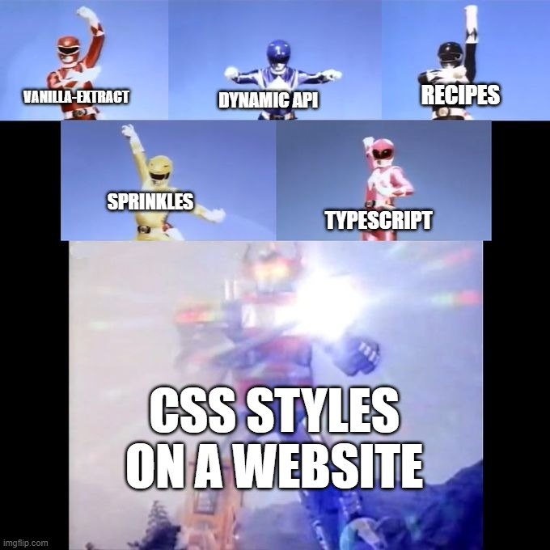
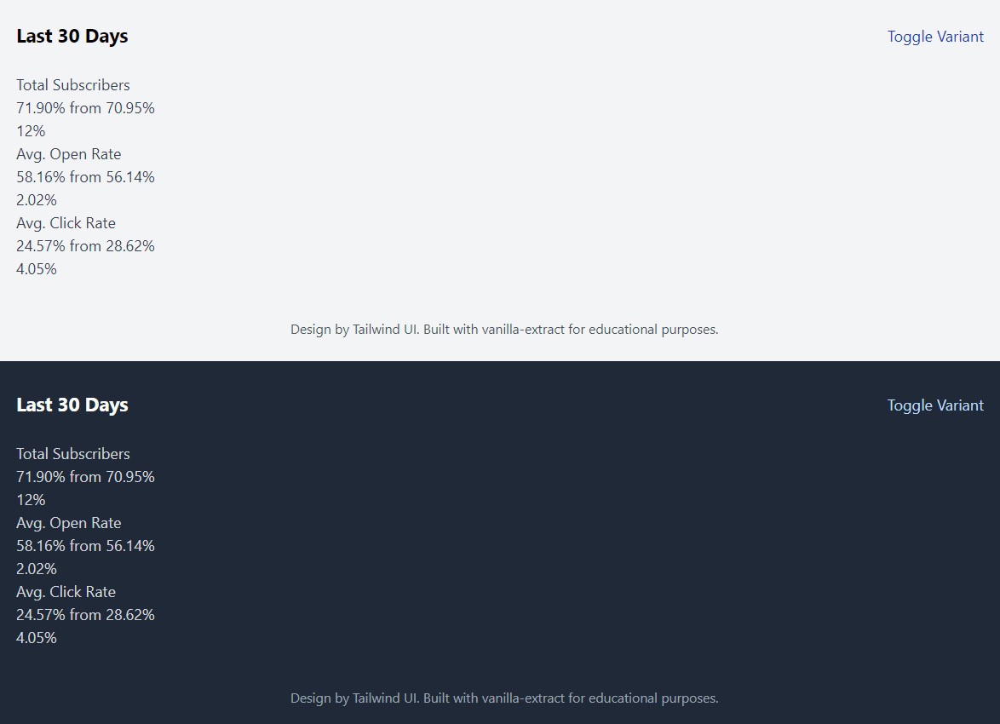

## Introduction

In this tutorial you'll learn how to write performant and type-safe CSS with [vanilla-extract][vanilla-extract]. The guide will explain how to build a [Tailwind UI](https://tailwindui.com/) component from scratch using most currently available vanilla-extract APIs. vanilla-extract has become my go-to CSS solution in any new React project as it combines the strengths of TypeScript and CSS modules, meaning: Best performance on the client but still a more convenient way of writing CSS than plain `.css` files.

I suspect that vanilla-extract will be _very_ popular in the near future so it's a great time to learn it now. It also taught me to use and think more about the built-in CSS Custom Properties (commonly known as "CSS Variables") of CSS. It's difficult with classic CSS-in-JS solutions (like emotion or styled-components) to get great performance results and with the recent additions to React like streaming and server components they also need to adapt more and more. Zero-runtime solutions like vanilla-extract are future-proof in that regard.

<Video
  src="/video/vanilla-extract-tailwind-ui.mp4"
  ariaLabel="Video showcasing the Tailwind UI component in light and dark mode. Also in different variants."
  description="Toggling between light and dark mode, default and inverted variants."
  maxWidth="1318px"
/>

You'll rebuild a [Tailwind UI mockup](https://tailwindui.com/components/application-ui/data-display/stats#component-72704cac437a06d94cdb941c274591ba) from scratch. It'll have support for light & dark mode, and also have two color variants. You can [see a live demo](https://vanilla-extract-tutorial.pages.dev/) and can find the code also on GitHub: [vanilla-extract-tutorial][tutorial-repo].

<Alert status="info" title="Intended audience">

You should have beginner knowledge in CSS and TypeScript as it'll enable you to navigate easier around the code and understand the CSS itself. The guide won't focus on the specifics of the CSS itself, but rather how to apply it with vanilla-extract. However, understanding TypeScript syntax and knowing the basics of CSS will really help you.

You'll use [Vite](https://vitejs.dev/) to build the demo site but no prior knowledge is necessary.

</Alert>

## Overview

> Use TypeScript as your preprocessor. Write type‑safe, locally scoped classes, variables and themes, then generate static CSS files at build time.

> Zero-runtime Stylesheets in TypeScript.

- order of instructions how I would start a project
- ref to official docs site
- start with barebones project with markup
- styling with vanilla-extract
- showing each of the most important APIs
- one could only use `style` API
- should probably not used that way in production
- ref my own site + rewrite



## Prerequisites

This guide assumes that you have `git`, `npm`, Node.js, and a code editor (e.g. VS Code) installed on your system. If not, you can follow guides on the internet to set up your machine for front-end development.

Clone the [tutorial repository][tutorial-repo] to your desired location:

```shell
git clone git@github.com:LekoArts/vanilla-extract-tutorial.git
```

Go into the newly cloned project and checkout the `tutorial-start` branch:

```shell
cd vanilla-extract-tutorial
git checkout tutorial-start
```

Install the required dependencies:

```shell
npm install
```

Lastly, check if everything is working by starting the Vite development server:

```shell
npm run dev
```

The terminal should print something like:

```shell
$ vite

  VITE v3.2.1  ready in 304 ms

  ➜  Local:   http://localhost:5173/
  ➜  Network: use --host to expose
```

Click on the `localhost` URL to open it in your browser. You should see an unstyled page with content. When the tutorial talks about the browser preview, it refers to this window.

## globalStyle

While the consistency of CSS between browsers has greatly improved over the years and CSS resets have faded away more and more, I still do like to use one. More specifically, I'm using [Josh Comeau's CSS reset](https://www.joshwcomeau.com/css/custom-css-reset/) to set some side-wide defaults. It's also a good way of introducing the [`globalStyle`][globalstyle] API.

With `globalStyle` you can create styles that are attached to a global selector. It's kinda like creating a normal `.css` file that is imported into an app.

vanilla-extract requires you to create every stylesheet as a `.css.ts` file as otherwise it can't find your defined styles. Navigate to the `src/styles` folder and create a new file called `global.css.ts`. Start with the following contents:

```ts title=src/styles/global.css.ts
import { globalStyle } from "@vanilla-extract/css"

globalStyle(`*`, {
  boxSizing: `border-box`,
  margin: 0,
})
```

vanilla-extract's styling APIs are all named imports from `@vanilla-extract/css`. The first parameter is a selector string, the second parameter a style object. So the above example will be compiled to the following CSS:

```css
* {
  box-sizing: border-box;
  margin: 0;
}
```

The `globalStyle` API can also be used to add styles depending on other scoped class names. You'll use this pattern in one of the later steps of this tutorial.

<Alert status="info" title="globalStyle restrictions">

Please note, that you can't use [complex selectors][complex-selectors] (using the `selectors` key) or pseudo selectors inside `globalStyle`. So this here won't work:

```ts
globalStyle(`h1`, {
  selectors: {
    `&:hover`: {
      color: `red`
    }
  },
  ":hover": {
    color: `red`
  }
})
```

</Alert>

Add the rest of the necessary styles to the file:

```ts title=src/styles/global.css.ts
import { globalStyle } from "@vanilla-extract/css"

globalStyle(`*`, {
  boxSizing: `border-box`,
  margin: 0,
})

globalStyle(`html, body`, {
  height: `100%`,
  fontSize: `18px`,
})

globalStyle(`body`, {
  lineHeight: 1.5,
  WebkitFontSmoothing: `antialiased`,
})

globalStyle(`img, picture, video, canvas, svg`, {
  display: `block`,
  maxWidth: `100%`,
})

globalStyle(`input, button, textare, select`, {
  font: `inherit`,
})

globalStyle(`p, h1, h2, h3, h4, h5, h6`, {
  overflowWrap: `break-word`,
})

globalStyle(`#root`, {
  isolation: `isolate`,
})
```

In order for these styles to be picked up you'll need to import the `global.css.ts` file into one of your app files, e.g. `src/components/app.tsx`. Add the import:

```tsx title=src/components/app.tsx highlight=4
import * as React from "react"
import { Stats, StatsItem } from "./stats"
import { useColorScheme } from "../hooks/use-color-scheme"
import "../styles/global.css"

// Rest of app.tsx
```

In case you're wondering why the import is `global.css` and not `global.css.ts`: Vite automatically handles the file extension like the other files.

You should now see slighly changed styles in your browser window.

## Theming

You might be wondering why so early in this tutorial the topic of theming is discussed already. It's because I think that starting out your app design with a defined design system is the best way to write consistent and maintainable CSS. And because it's a hassle to switch out individual CSS styles with design tokes after the fact, you'll now learn how to use vanilla-extract's theming APIs.

The [`createTheme`][create-theme] and [`createThemeContract`][create-theme-contract] APIs are not only valuable when defining multiple themes, it's perfectly fine to also use it for just one theme. If you then later decide to add a new theme everything will already be set up.

Start by creating a new file inside the `src/styles` directory called `themes.css.ts`. As a start, it'll contain the necessary imports from `@vanilla-extract/css` and some design tokens. You can take the design tokens from anywhere, in this instance I used parts of the Tailwind CSS color palette for the colors.

```ts title=src/styles/themes.css.ts
import { createThemeContract, createTheme } from "@vanilla-extract/css"

const SYSTEM_FONT_STACK = `-apple-system, BlinkMacSystemFont, "Segoe UI", Roboto,
Helvetica, Arial, sans-serif, "Apple Color Emoji", "Segoe UI Emoji", "Segoe UI Symbol"`

export const colors = {
  black: `#000`,
  white: `#fff`,
  gray50: `#f9fafb`,
  gray100: `#f3f4f6`,
  gray200: `#e5e7eb`,
  gray300: `#d1d5db`,
  gray400: `#9ca3af`,
  gray500: `#6b7280`,
  gray600: `#4b5563`,
  gray700: `#374151`,
  gray800: `#1f2937`,
  gray900: `#111827`,
  red50: `#fef2f2`,
  red100: `#fee2e2`,
  red200: `#fecaca`,
  red300: `#fca5a5`,
  red400: `#f87171`,
  red500: `#ef4444`,
  red600: `#dc2626`,
  red700: `#b91c1c`,
  red800: `#991b1b`,
  red900: `#7f1d1d`,
  green50: `#f0fdf4`,
  green100: `#dcfce7`,
  green200: `#bbf7d0`,
  green300: `#86efac`,
  green400: `#4ade80`,
  green500: `#22c55e`,
  green600: `#16a34a`,
  green700: `#15803d`,
  green800: `#166534`,
  green900: `#14532d`,
  blue50: `#eff6ff`,
  blue100: `#dbeafe`,
  blue200: `#bfdbfe`,
  blue300: `#93c5fd`,
  blue400: `#60a5fa`,
  blue500: `#3b82f6`,
  blue600: `#2563eb`,
  blue700: `#1d4ed8`,
  blue800: `#1e40af`,
  blue900: `#1e3a8a`,
}

export const breakpoints = {
  mobile: 0,
  tablet: 768,
  desktop: 1200,
}
```

As you can see this file also defines a [system font stack](https://systemfontstack.com/) and `breakpoints`. The latter will be used later for CSS media queries. These constants don't have to be in this file, you could import these things also from other separate files.

One important note about the colors: They all have to be flat, you can't nest them, e.g. `blue: { 100: '#dbeafe' }`. That's why the colors are defined as `blue100`.

<Alert status="info" title="Abbreviated code blocks">

For the sake of keeping code block examples short I'll omit these design tokens in the following examples. They still exist though!

</Alert>

### createThemeContract

Before creating your light and dark themes you should set up a contract that defines which properties each theme should have. Otherwise you could end up in a situation where one theme has a certain property, and the other one not. As an example:

```ts
const light = {
  button: `some-value`,
}
const dark = {}

const cssStyle = isDark ? dark.button : light.button
```

When `isDark` is truthy, this will fail as `dark.button` doesn't exist. With `createThemeContract` you can enforce that things like these won't happen.

When creating the contract the values of the input are ignored so you can pass in an empty string, `null` or real values. Add the following to your `themes.css.ts` file:

```ts title=src/styles/themes.css.ts
// Rest of the imports and design tokens...

export const vars = createThemeContract({
  colors: {
    primary: ``,
    body: ``,
    background: ``,
    link: ``,
    linkHover: ``,
    ...colors,
  },
  font: {
    body: ``,
  },
  fontSize: {
    xs: ``,
    sm: ``,
    md: ``,
    lg: ``,
    xl: ``,
  },
  space: {
    xs: ``,
    sm: ``,
    md: ``,
    lg: ``,
    xl: ``,
  },
  boxShadow: {
    sm: ``,
    md: ``,
    lg: ``,
  },
  radii: {
    sm: ``,
    md: ``,
    full: ``,
  },
})
```

You have done two things now:

1. You defined a theme contract that other themes (created with `createTheme`) can implement. Each theme now has to have these keys.
1. You have declared a `vars` variable that can be used in other vanilla-extract stylesheets to reference design tokens. Depending on which theme currently is active the correct values are automatically used.

### createTheme

Now that you have a theme contract, it's time to define your light and dark themes. For the sake of this tutorial they are both defined in `themes.css.ts` but in production usage I'd advise to place each theme into its own file (for better tree-shaking).

`createTheme` creates a locally scoped class name **and** a theme contract. But since the contract already exists, you'll only use the class name (for more information on the latter, you can read the [`createTheme` docs][create-theme]).

Edit your `themes.css.ts`:

```ts title=src/styles/themes.css.ts
// Rest of the imports, design tokens, and theme contract...

export const lightThemeClass = createTheme(vars, {
  colors: {
    primary: colors.blue500,
    body: colors.gray700,
    background: colors.gray100,
    link: colors.blue800,
    linkHover: colors.blue600,
    ...colors,
  },
})

export const darkThemeClass = createTheme(vars, {
  colors: {
    primary: colors.blue400,
    body: colors.gray300,
    background: colors.gray800,
    link: colors.blue200,
    linkHover: colors.blue400,
    ...colors,
  },
})
```

TypeScript should now yell at you, saying something like `No overload matches this call.`. Why is that? It's because your light and dark themes are missing properties! So far you only defined the `colors` but the theme contract enforces all the other properties, too.

Of course, you could now manually write out the missing CSS for each theme, but if it doesn't change between themes then it makes sense to put that into its own variable. Add a `commonVars` to the file:

```ts title=src/styles/themes.css.ts
const commonVars = {
  font: {
    body: SYSTEM_FONT_STACK,
  },
  space: {
    xs: `0.25rem`,
    sm: `0.5rem`,
    md: `1rem`,
    lg: `1.5rem`,
    xl: `2.5rem`,
  },
  fontSize: {
    xs: `0.8rem`,
    sm: `0.875rem`,
    md: `1rem`,
    lg: `1.25rem`,
    xl: `1.5rem`,
  },
  boxShadow: {
    sm: `0 1px 2px 0 rgb(0 0 0 / 0.05)`,
    md: `0 4px 6px -1px rgb(0 0 0 / 0.1), 0 2px 4px -2px rgb(0 0 0 / 0.1)`,
    lg: `0 10px 15px -3px rgb(0 0 0 / 0.1), 0 4px 6px -4px rgb(0 0 0 / 0.1)`,
  },
  radii: {
    sm: `0.2rem`,
    md: `0.4rem`,
    full: `100%`,
  },
}
```

You can now spread that object into each theme and the compiler should be happy:

```ts title=src/styles/themes.css.ts highlight=10,22
export const lightThemeClass = createTheme(vars, {
  colors: {
    primary: colors.blue500,
    body: colors.gray700,
    background: colors.gray100,
    link: colors.blue800,
    linkHover: colors.blue600,
    ...colors,
  },
  ...commonVars,
})

export const darkThemeClass = createTheme(vars, {
  colors: {
    primary: colors.blue400,
    body: colors.gray300,
    background: colors.gray800,
    link: colors.blue200,
    linkHover: colors.blue400,
    ...colors,
  },
  ...commonVars,
})
```

Congrats, you successfully created a light and dark theme using a theme contract.

<Collapsible summary={<em>Pro Tip: Using Open Props</em>}>

Some food for thought: You could use [Open Props](https://open-props.style/) together with vanilla-extract. You can use it in your themes or directly in the styles of a component.

```ts title=themes.css.ts
import { style, createVar } from "@vanilla-extract/css"
import OPColors from "open-props/src/colors"

export const colors = OPColors
```

```ts title=button.css.ts
import { style, createVar } from "@vanilla-extract/css"
import OP from "open-props"

export const accentVar = createVar()
export const onAccent = createVar()

export const button = style({
  vars: {
    [accentVar]: OP.indigo7,
    [onAccent]: OP.indigo0,
  },
  backgroundColor: accentVar,
  color: onAccent,
  padding: `${OP.size4} ${OP.size8}`,
  borderRadius: OP.radius2,
  border: "none",
  ":hover": {
    vars: {
      [accentVar]: OP.indigo8,
      [onAccent]: "white",
    },
  },
})
```

It doesn't have to be Open Props of course, feel free to use other libraries like Tailwind!

</Collapsible>

### Using theme classes

Now that you have `lightThemeClass` and `darkThemeClass` available as variables, you need to apply the class names to a DOM element. You'll add it to the outermost wrapper of the app. However, by being able to place it everywhere you want to could theoretically create powerful combinations of locally scoped CSS, so use multiple themes simultanously on the same page.

Open `src/components/app.tsx`, import both class names and adjust `schemeClass` with its values:

```tsx title=src/components/app.tsx highlight=2,9
import * as React from "react"
import { lightThemeClass, darkThemeClass } from "../styles/themes.css"
import { Stats, StatsItem } from "./stats"
import { useColorScheme } from "../hooks/use-color-scheme"
import "../styles/global.css"

const App: React.FC = () => {
  const scheme = useColorScheme()
  const schemeClass = scheme === `dark` ? darkThemeClass : lightThemeClass
  const [variant, setVariant] = React.useState<"default" | "invert">(`default`)

  // Rest of component...
```

If you use your browser's developer tools (Right click => Inspect element) to look at the HTML, you should now see a `<div>` with a class name like `themes_lightThemeClass__h8kum61s` (or `themes_darkThemeClass__h8kum61t` during dark mode - the hash at the end will probably not match with yours, which is fine). The `<div>` defines CSS custom properties:

```css
.themes_lightThemeClass__h8kum61s {
  --colors-background__h8kum62: #f3f4f6;
  /* etc. */
}
```

In the next step you'll be using the exported `vars` variable. When accessing those properties, you'll behind the scenes use CSS custom properties that are defined in `.themes_lightThemeClass__h8kum61s`. _How cool is that?!_

## style & styleVariants

After setting up a lot of boilerplate, it's now finally time to write some CSS for the actual app! If you have used CSS modules in the past, the `style` API will make you feel right at home. In this part you'll learn how to use [`style`][style-api] and [`styleVariants`][style-variants] to style the `<App>` component.

`style` creates a style rule with a locally scoped class name which you then can directly import into your component. `styleVariants` creates a collection of style rules, really useful when mapping component props to styles, e.g. `<button className={styles.background[props.variant]}>`.

<Collapsible summary={<em>Why I love <code>styleVariants</code> ❤️</em>}>

`styleVariants` is probably my favourite vanilla-extract API. You can easily style your whole app only with `style` and `styleVariants`. In my personal site I often use `styleVariants` for components that have different variants, e.g. an `<Alert>` component. I think it's a really clear and easy to understand API that maps directly to the React component it is used in. You can also share TypeScript types.

Here's an example of an `<Alert>` component with multiple variants. Depending on the variant it should have a different `background`. In addition, there should also be variants for both light and dark theme. Ask yourself the question, how would you currently solve this problem in your app or at work?

The vanilla-extract stylesheet:

```ts title=alert.css.ts
import {
  createVar,
  style,
  StyleRule,
  styleVariants,
} from "@vanilla-extract/css"
import { themesSelectors } from "../../styles/atoms.css"
import { vars } from "../../styles/themes/contract.css"
import { colorPalette } from "../../styles/tokens/colors"

export type AlertStatus = "info" | "warning" | "error" | "success"

const bgVar = createVar()

const alertBaseStyle = style({
  vars: {
    [bgVar]: vars.color.bg,
  },
  background: bgVar,
})

const colorMap = {
  info: `blue`,
  warning: `orange`,
} as const

const darkBg = 200
const bg = 100

const alerts: Record<AlertStatus, StyleRule> = {
  info: {
    vars: {
      [bgVar]: colorPalette[colorMap.info][bg],
    },
    selectors: {
      [themesSelectors.dark]: {
        vars: {
          [bgVar]: colorPalette[colorMap.info][darkBg],
        },
      },
    },
  },
  warning: {
    vars: {
      [bgVar]: colorPalette[colorMap.warning][bg],
    },
    selectors: {
      [themesSelectors.dark]: {
        vars: {
          [bgVar]: colorPalette[colorMap.warning][darkBg],
        },
      },
    },
  },
}

export const alertVariants = styleVariants(alerts, (alert) => [
  alertBaseStyle,
  alert,
])
```

The base style defines the `bgVar` CSS variable and assigns it to `background`. Then, depending on the `AlertStatus`, the CSS variable is overriden. The `selectors` key is used to handle the dark mode case. How it's used in the React component:

```tsx title=alert.tsx
import { AlertStatus, alertVariants } from "./alert.css"

interface IAlertProps {
  title: string
  status: AlertStatus
}

export const Alert: React.FC<React.PropsWithChildren<IAlertProps>> = ({
  status,
  children,
}) => <div className={alertVariants[status]}>{children}</div>
```

</Collapsible>

### style

Create a new vanilla-extract stylesheet called `app.css.ts` but this time inside `src/components`:

```ts title=src/components/app.css.ts
import { style } from "@vanilla-extract/css"
import { vars } from "../styles/themes.css"

export const wrapper = style({})
```

You can define CSS rules by passing an array of class names and/or style objects to `style()`. CSS Variables, simple pseudo elements, selectors, and media/feature queries are also supported (refer to the [`style` docs][style-api] for more information). By exporting `wrapper` you have access to its class name and can use it inside your React component.

<Alert status="info" title="style() inputs">

As said above, `style()` not only accepts a style object, but also an array of class names. Or in other words: You can use other `style()` definitions in `style()`.

```ts
// Behind the scenes this generates a class name
const base = style({ padding: 12 })

// This is an array of class names & style objects
const wrapper = style([base, { background: `blue` }])
```

</Alert>

Switch to the `<App>` component and import the newly created style. You can either use named imports or use a splat import. The latter will be used here:

```tsx title=src/components/app.tsx highlight=5
import * as React from "react"
import { lightThemeClass, darkThemeClass } from "../styles/themes.css"
import { Stats, StatsItem } from "./stats"
import { useColorScheme } from "../hooks/use-color-scheme"
import * as styles from "./app.css"
import "../styles/global.css"

// Rest of app.tsx
```

Next, add the `styles.wrapper` class name to the wrapper component (currently `<div className={schemeClass}>`). But this component already has a class name defined... You'll need to apply multiple ones at the same time.

I'd recommend using [clsx](https://github.com/lukeed/clsx) in production, for the sake of this tutorial you'll be using `.join(' ')`.

```tsx title=src/components/app.tsx
return (
  <div className={[schemeClass, styles.wrapper].join(` `)}>
    <main>
```

If you look at your browser, nothing should have changed just yet as the style rule is still empty. Switch back to `app.css.ts` and apply the following:

```ts title=src/components/app.css.ts
import { style } from "@vanilla-extract/css"
import { vars } from "../styles/themes.css"

export const wrapper = style({
  fontFamily: vars.font.body,
  backgroundColor: vars.colors.background,
  color: vars.colors.body,
  height: `100vh`,
  width: `100%`,
  display: `flex`,
  justifyContent: `center`,
  alignItems: `center`,
  fontSize: vars.fontSize.md,
})
```

You're using the `vars` from your previously created theme contract now. You can inspect the HTML and CSS with your browser's developer tools to understand better what's going on. In the previous step you added `themes_lightThemeClass__someHash` to your outer most wrapper. The CSS class defined CSS variables. Your now newly created `wrapper` class uses these CSS variables:

```css
.themes_lightThemeClass__h8kum61s {
  --colors-background__h8kum62: #f3f4f6;
  /* etc. */
}

.app_wrapper__2ibns60 {
  background-color: var(--colors-background__h8kum62);
  /* etc. */
}
```

Add other `style` definitions to `app.css.ts`:

```ts title=src/components/app.css.ts
export const innerWrapper = style({
  maxWidth: `1200px`,
  width: `100%`,
  padding: vars.space.lg,
})

export const topBar = style({
  display: `flex`,
  justifyContent: `space-between`,
  alignItems: `center`,
  marginBottom: vars.space.lg,
})

export const button = style({
  border: `none`,
  background: `none`,
  color: vars.colors.link,
  borderWidth: `1px`,
  borderStyle: `solid`,
  borderColor: `transparent`,
  transition: `all 0.3s ease-in-out`,
  borderRadius: vars.radii.sm,
  paddingLeft: vars.space.sm,
  paddingRight: vars.space.sm,
  selectors: {
    "&:hover": {
      color: vars.colors.linkHover,
      cursor: `pointer`,
      borderColor: vars.colors.linkHover,
    },
  },
})
```

The `button` uses the `selectors` key to add `:hover` styles. You have to use the `&`, otherwise vanilla-extract will complain. You can also use other pseudo classes like `:focus` or `:active`.

Add the CSS classes to `app.tsx`:

```tsx title=src/components/app.tsx highlight=3,4,8
return (
  <div className={[schemeClass, styles.wrapper].join(` `)}>
    <main className={styles.innerWrapper}>
      <div className={styles.topBar}>
        <div>Last 30 Days</div>
        <button
          type="button"
          className={styles.button}
          onClick={() => (variant === `default` ? setVariant(`invert`) : setVariant(`default`))}
        >
          Toggle Variant
        </button>
      </div>
```

When visiting the browser preview, you should now already see "Last 30 Days" on the very left, and a styled "Toggle Variant" button the right.

<Alert status="info" title="vanilla-extract file names">

You named the vanilla-extract stylesheet for the `app.tsx` component `app.css.ts` and placed it as a sibling to the React component. This shows my recommended way of creating vanilla-extract stylesheets. When looking at a React component you can more easily find the associated CSS for it as it's a direct sibling and through file search you can look for `<component-name>.css.ts`.

</Alert>

### styleVariants

In the next step you'll be using `styleVariants` to style the heading in the `topBar` and the `footer` depending on light and dark theme. Add the `styleVariants` import to `app.css.ts` and add the following:

```ts title=src/components/app.css.ts
import { style, styleVariants } from "@vanilla-extract/css"
import { vars } from "../styles/themes.css"
// Rest of styles...

const topBarHeadingBase = style({
  fontSize: vars.fontSize.lg,
  fontWeight: 700,
})

export const topBarHeading = styleVariants({
  light: [topBarHeadingBase, { color: `black` }],
  dark: [topBarHeadingBase, { color: `white` }],
})

const footerBase = style({
  fontSize: vars.fontSize.sm,
  textAlign: `center`,
  marginTop: vars.space.xl,
})

const footerColors = {
  light: vars.colors.gray600,
  dark: vars.colors.gray400,
}

export const footer = styleVariants(footerColors, (color) => [
  footerBase,
  { color },
])
```

A lot is going on here, so let's unpack it.

- You can use `styleVariants` in two different forms. Either provide only one function parameter (an object) or define two function parameters (an object and a mapping function).
- You can use [style composition][style-composition] to more easily re-use styles. In this example you're re-using `topBarHeadingBase` and `footerBase` to apply to both variants (light and dark).
- You can define style rules not only as an style object but also as an array of class names and/or style objects (see `[topBarHeadingBase, { color: 'black' }]` or `[footerBase, { color }]`).

<Alert status="info" title="styleVariants mapping function">

You'll probably most often use `styleVariants` with a mapping function, at least that's for me the case. You can of course also use nested properties for different style variants, for example:

```ts
const footerStyles = {
  light: {
    color: `black`,
    background: `white`,
  },
  dark: {
    color: `white`,
    background: `dark`,
  },
}

export const footer = styleVariants(footerStyles, (style) => style)
```

</Alert>

Add the styles to `<App>`:

```tsx title=src/components/app.tsx highlight=17,34
import * as React from "react"
import { lightThemeClass, darkThemeClass } from "../styles/themes.css"
import { Stats, StatsItem } from "./stats"
import { useColorScheme } from "../hooks/use-color-scheme"
import * as styles from "./app.css"
import "../styles/global.css"

const App: React.FC = () => {
  const scheme = useColorScheme()
  const schemeClass = scheme === `dark` ? darkThemeClass : lightThemeClass
  const [variant, setVariant] = React.useState<"default" | "invert">(`default`)

  return (
    <div className={[schemeClass, styles.wrapper].join(` `)}>
      <main className={styles.innerWrapper}>
        <div className={styles.topBar}>
          <div className={styles.topBarHeading[scheme]}>Last 30 Days</div>
          <button
            type="button"
            className={styles.button}
            onClick={() =>
              variant === `default`
                ? setVariant(`invert`)
                : setVariant(`default`)
            }
          >
            Toggle Variant
          </button>
        </div>
        <Stats variant={variant}>
          <StatsItem
            label="Total Subscribers"
            from={70.946}
            to={71.897}
            percentage={12}
          />
          <StatsItem
            label="Avg. Open Rate"
            from={56.14}
            to={58.16}
            percentage={2.02}
          />
          <StatsItem
            label="Avg. Click Rate"
            from={28.62}
            to={24.57}
            percentage={-4.05}
          />
        </Stats>
        <div className={styles.footer[scheme]}>
          Design by Tailwind UI. Built with vanilla-extract for educational
          purposes.
        </div>
      </main>
    </div>
  )
}

export default App
```

Congrats, you successfully styled the `<App>` component! Your page should now look like this (light mode at the top & dark mode at the bottom):



## Sprinkles

So far I've shown vanilla-extract APIs that are part of `@vanilla-extract/css`, it's kind of the "core" package of vanilla-extract. But the authors also offer additional packages that you can use. The first one you'll use and learn is Sprinkles.

[Sprinkles][sprinkles] generates a static set of custom utility classes that you can use throughout your app. With Sprinkles you can build your own zero-runtime, type-safe version of [Tailwind](https://tailwindcss.com/) or [Styled System](https://styled-system.com/).

<Collapsible summary={<em>Tailwind to Sprinkles Comparisons</em>}>

Here's how you would write Tailwind-like utlity classes with Sprinkles:

```html title=Tailwind
<main class="text-xl max-w-xl p-4">Hello World</main>
```

```tsx title=Sprinkles
import { sprinkles as s } from "./sprinkles.css"

const Page = () => (
  <main className={s({ fontSize: `xl`, maxWidth: `xl`, p: 4 })}>
    Hello World
  </main>
)
```

Tailwind supports responsive design and dark mode but with the right configuration Sprinkles can do that, too!

```html title=Tailwind
<main class="w-16 sm:w-32 text-center sm:text-left bg-white dark:bg-slate-800">
  Hello World
</main>
```

```tsx title=Sprinkles
import { sprinkles as s } from "./sprinkles.css"

// You can use object notation or array notation for conditions
const Page = () => (
  <main
    className={s({
      width: { default: 16, sm: 32 },
      textAlign: [`center`, `left`],
      background: { light: `white`, dark: `bgSlate800` },
    })}
  >
    Hello World
  </main>
)
```

I hope these examples clicked for you and you can understand the immediate value that Sprinkles can offer. The Sprinkles version might seem more verbose but you can create your own `<Box>` component to mitigate that. At the end of this section you'll learn more about that.

</Collapsible>

### Defining Sprinkles

Without further ado, let's add Sprinkles to your design ✨

Inside the `src/styles` folder, create a new file called `sprinkles.css.ts` and import the necessary functions and constants:

```ts title=src/styles/sprinkles.css.ts
import { createSprinkles, defineProperties } from "@vanilla-extract/sprinkles"
import { breakpoints, vars } from "./themes.css"

const { space, colors, fontSize, radii, boxShadow } = vars
```

`@vanilla-extract/sprinkles` exports a couple of functions and TypeScript types, however the two most important functions you'll use are:

- `defineProperties`: Let's you create a collection of utility classes with properties, conditions, and shorthands. You can use `defineProperties` multiple times to define collections scoped to different properties (e.g. some have media queries, other light/dark mode).
- `createSprinkles`: Enables you to create a type-safe function to access your defined properties. You can provide one or more collections defined by `defineProperties`.

Start by adding unresponsive properties to the file. This showcases the most basic form of using `defineProperties` as you only provide `properties`:

```ts title=src/styles/sprinkles.css.ts
// Imports...

const unresponsiveProperties = defineProperties({
  properties: {
    fontSize,
    lineHeight: fontSize,
    textAlign: [`center`, `left`, `right`],
    textTransform: [`lowercase`, `uppercase`],
    fontWeight: [400, 500, 600, 700, 800],
    textDecoration: [`none`, `underline`],
    borderRadius: radii,
    boxShadow,
  },
})
```

We don't need these properties to have conditions on e.g. screen size or light/dark mode. They don't need to change when these things change.

<Alert status="info" title="Ways of defining properties">

You can define properties as an array, as an object, or use vanilla-extract themes.

```ts
import { defineProperties } from "@vanilla-extract/sprinkles"
import { vars } from "./themes.css"

/*
vars.radii is an object like { md: '0.2rem', full: '100%' }
*/

const propertiesDemo = defineProperties({
  properties: {
    // Mapping of valid CSS values
    textAlign: [`center`, `left`, `right`],
    // key-value mapping object
    fontWeight: {
      normal: 400,
      medium: 500,
    },
    // Using vanilla-extract themes
    borderRadius: vars.radii,
  },
})
```

</Alert>

Next, define properties that rely on `colors`. Remember the big `colors` object you defined earlier in `themes.css.ts`? It'll be used now for `color`, `background`, and `borderColor`:

```ts title=src/styles/sprinkles.css.ts
// Imports and unresponsiveProperties...

const colorProperties = defineProperties({
  conditions: {
    light: {
      "@media": `(prefers-color-scheme: light)`,
    },
    dark: { "@media": `(prefers-color-scheme: dark)` },
    hover: { selector: `&:hover` },
    focus: { selector: `&:focus` },
  },
  properties: {
    color: colors,
    background: colors,
    borderColor: colors,
  },
})
```

This snippet showcases how to provide `conditions` for said properties. `conditions` can be a media, feature, or container query or a selector. The `light` and `dark` conditions are met when the media query is truthy. The `hover` and `focus` conditions are met when the DOM element is in the `:hover` or `:focus` state.

TypeScript should complain to you that a property is missing. And yes, it is! You need to define a `defaultCondition`. Most often you want to define values that are non-conditional when using Sprinkles, e.g. `sprinkles({ color: 'black' })`. Add it to your `colorProperties`:

```ts title=src/styles/sprinkles.css.ts highlight=12
// Imports and unresponsiveProperties...

const colorProperties = defineProperties({
  conditions: {
    light: {
      "@media": `(prefers-color-scheme: light)`,
    },
    dark: { "@media": `(prefers-color-scheme: dark)` },
    hover: { selector: `&:hover` },
    focus: { selector: `&:focus` },
  },
  defaultCondition: [`light`, `dark`],
  properties: {
    color: colors,
    background: colors,
    borderColor: colors,
  },
})
```

`defaultCondition` can be a single condition or an array of conditions. You'll see this in just a bit again when you'll learn about the responsive properties. In this instance the conditions are mutually exclusive (light and dark mode can't be met at the same time) so you need to define both as a `defaultCondition`.

TypeScript should be happy now and the code `sprinkles({ color: 'black' })` automatically evaluates to `sprinkles({ color: { light: 'black', dark: 'black' }})`.

The last `defineProperties` call will add properties that should be responsive to CSS media queries. Add it to your `sprinkles.css.ts` file:

```ts title=src/styles/sprinkles.css.ts
// Imports, unresponsiveProperties, colorProperties...

function transformBreakpoints<Output>(input: Record<string, any>) {
  let responsiveConditions!: Output

  Object.entries(input).forEach(([key, value]) => {
    if (value === 0) {
      responsiveConditions = {
        ...responsiveConditions,
        [key]: {},
      }
    } else {
      responsiveConditions = {
        ...responsiveConditions,
        [key]: {
          "@media": `screen and (min-width: ${value}px)`,
        },
      }
    }
  })

  return responsiveConditions
}

const responsiveProperties = defineProperties({
  conditions: transformBreakpoints<{ mobile: {}; tablet: {}; desktop: {} }>(
    breakpoints
  ),
  defaultCondition: `mobile`,
  responsiveArray: [`mobile`, `tablet`, `desktop`],
  properties: {
    position: [`relative`],
    display: [`none`, `block`, `inline`, `inline-block`, `flex`],
    alignItems: [`flex-start`, `center`, `flex-end`, `baseline`],
    justifyContent: [`flex-start`, `center`, `flex-end`, `space-between`],
    flexDirection: [`row`, `row-reverse`, `column`, `column-reverse`],
    flexWrap: [`wrap`, `nowrap`],
    padding: space,
    paddingTop: space,
    paddingBottom: space,
    paddingLeft: space,
    paddingRight: space,
    margin: space,
    marginTop: space,
    marginBottom: space,
    marginLeft: space,
    marginRight: space,
  },
  shorthands: {
    p: [`paddingTop`, `paddingBottom`, `paddingLeft`, `paddingRight`],
    px: [`paddingLeft`, `paddingRight`],
    py: [`paddingTop`, `paddingBottom`],
    m: [`marginTop`, `marginBottom`, `marginLeft`, `marginRight`],
    mx: [`marginLeft`, `marginRight`],
    my: [`marginTop`, `marginBottom`],
  },
})
```

<Collapsible summary={<em>Insight: transformBreakpoints</em>}>

`transformBreakpoints` is a utility function to take in the `breakpoints` defined in `themes.css.ts` and spit out a valid `conditions` object for Sprinkles.

If you take this as an input:

```ts
export const breakpoints = {
  mobile: 0,
  tablet: 768,
}
```

For the `mobile` case the `value === 0` condition will be truthy and only an empty object will be returned. For the `tablet` case a media query will be defined.

The output looks something like this:

```ts
{
  mobile: {},
  tablet: {
    "@media": `screen and (min-width: 768px)`
  }
}
```

</Collapsible>

The `responsiveProperties` has two new keys: `reponsiveArray` and `shorthands`. Here's an explainer on both of them:

- `reponsiveArray`: This is an array of condition names and it enables the "responsive array notation". If that doesn't ring a bell, here's an example:

  Instead of writing `flexWrap: { mobile: 'wrap', desktop: 'nowrap' }` you can write `flexWrap: ['wrap', null, 'nowrap']`.

- `shorthands`: You can map custom shorthands to multiple CSS properties. So with the example above in mind, instead of writing out `paddingLeft` and `paddingRight` you can just use `px`

Last but not least, it's time to create the Sprinkles function. Add the following to your `sprinkles.css.ts`:

```ts title=src/styles/sprinkles.css.ts
// Rest of the file...

export const sprinkles = createSprinkles(
  responsiveProperties,
  colorProperties,
  unresponsiveProperties
)
export type Sprinkles = Parameters<typeof sprinkles>[0]
```

You can now use the `sprinkles` function to access your defined properties in a type-safe way. The exported `Sprinkles` TypeScript type will be helpful when creating custom React components or style objects passed to the `sprinkles` function. For example, you can define an object with the type `Sprinkles` and you can be sure that the input is valid:

```ts
const myStyles: Sprinkles = {
  px: `lg`,
  py: `md`,
}

const className = sprinkles(myStyles)
```

<Alert status="warning" title="Mitigating CSS classes bloat">

Now that you know how to define properties with and without conditions, you might think: Couldn't I just make everything conditional? Yes, you could. **But you should not!**

For every property and every condition a new class has to be created, or in other words: The amount of CSS classes generated can quickly explode if you have too many properties and conditions. Take care in choosing which properties need to be responsive and which not. Move as many properties as possible into a simple `unresponsiveProperties` definition.

If you have the need to e.g. have `fontWeight` responsive in just one case, then don't make `fontWeight` responsive in your Sprinkles configuration. Instead, use [media queries in your `style`][media-queries] and don't feel bad that for this one-off case you didn't use Sprinkles.

Furthermore, ask yourself if you need the property inside Sprinkles at all. I like to add more properties at the beginning, then build out my app, and then afterwards check how much I actually used the individual property. You can find that out by e.g. using the search in your IDE. If you then find out for example, that you only used a property once or twice, I'd recommend moving these to `style()` and removing them from Sprinkles.

</Alert>

### Using Sprinkles

Basically the `sprinkles` function you created in the last section returns a class list which you can use as if it were a single class. This means that you can use `sprinkles` on its own (directly in React components or `.css.ts` files) or use it inside `style()`, `styleVariants()`, `globalStyle()` or Recipes API (more on that later).

<Alert status="info" title="Sprinkles: Usage">

Inside a React component:

```tsx
import { sprinkles } from "./sprinkles.css"

const Container = () => (
  <div className={sprinkles({ py: 4, fontSize: `lg` })}>Hello World</div>
)
```

As a class name that you import:

```ts
import { sprinkles } from "./sprinkles.css"

export const container = sprinkles({
  py: 4,
  fontSize: `lg`,
})
```

Inside `style()`, `styleVariants()`, and `globalStyle()`:

```ts
import { style, styleVariants, globalStyle } from "@vanilla-extract/css"
import { sprinkles } from "./sprinkles.css"

export const wrapper = sprinkles({
  px: 4,
})

export const container = style([
  sprinkles({
    py: 4,
    fontSize: `lg`,
  }),
  {
    color: `red`,
  },
])

export const variants = styleVariants({
  default: [sprinkles({ py: 4 })],
  invert: [sprinkles({ px: 4 })],
})

globalStyle(`${wrapper} *`, {
  textDecoration: `underline`,
})
```

As you can see Sprinkles can also be used purely in `.css.ts` files as an alternative way of accessing the design tokens. My preferred way of using Sprinkles is purely inside React components unless I need to combine CSS styles that are not inside Sprinkles (for this I combine Sprinkles with `style()` then). At the end of this section you'll also learn how to create your own `<Box>` component with Sprinkles which removes some of the verbosity from using `className={sprinkles()}` everywhere.

</Alert>

Coming back to the tutorial app, create a new file inside `src/components` called `stats.css.ts`. Add the following contents:

```ts title=src/components/stats.css.ts
import { style, styleVariants } from "@vanilla-extract/css"
import { sprinkles, Sprinkles } from "../styles/sprinkles.css"
import { breakpoints, vars } from "../styles/themes.css"

const bs = style({
  width: `100%`,
  selectors: {
    "&:first-child": {
      borderRightWidth: `1px`,
      borderRightStyle: `solid`,
    },
    "&:last-child": {
      borderLeftWidth: `1px`,
      borderLeftStyle: `solid`,
    },
  },
  "@media": {
    [`screen and (max-width: ${breakpoints.desktop}px)`]: {
      selectors: {
        "&:first-child": {
          borderRightWidth: `0px`,
        },
        "&:last-child": {
          borderLeftWidth: `0px`,
        },
      },
    },
  },
})

const bws: Sprinkles = {
  px: `lg`,
  py: `md`,
}

export const wrapper = styleVariants({
  default: [
    bs,
    sprinkles({ ...bws, borderColor: { light: `gray200`, dark: `gray700` } }),
  ],
  invert: [
    bs,
    sprinkles({ ...bws, borderColor: { light: `blue400`, dark: `blue600` } }),
  ],
})

export const toValue = styleVariants({
  default: [sprinkles({ color: { light: `primary`, dark: `primary` } })],
  invert: [sprinkles({ color: { light: `white`, dark: `white` } })],
})

export const arrowUp = style({
  height: 0,
  width: 0,
  borderLeft: `5px solid transparent`,
  borderRight: `5px solid transparent`,
  borderBottom: `5px solid ${vars.colors.green400}`,
})

export const arrowDown = style({
  height: 0,
  width: 0,
  borderLeft: `5px solid transparent`,
  borderRight: `5px solid transparent`,
  borderTop: `5px solid ${vars.colors.red500}`,
})
```

The code showcases all the techniques you learned so far. That's the complete `stats.css.ts` file.

Time to move to the `src/components/stats.tsx` file. Open it up and get yourself an overview. You'll use class names from `stats.css.ts` to style the `<Trend>` and `<StatsItem>` component.

Add the imports to the file:

```tsx title=src/components/stats.tsx highlight=2,3
import * as React from "react"
import { sprinkles as s } from "../styles/sprinkles.css"
import { wrapper, toValue, arrowUp, arrowDown } from "./stats.css"

// Rest of the file...
```

Notice that `sprinkles` was renamed on import to `s` so that one can use `s()` instead of `sprinkles()`. It's time now to finally use it in the React components. While applying the styles is not necessarily super exciting (as you already know how to apply it), you can at least see some progress in the browser preview. First, replace the `<StatsItem>` component with the styled code:

```tsx title=src/components/stats.tsx
// Rest of imports and components...

export const StatsItem: React.FC<IStatsItemProps> = ({
  label,
  from,
  to,
  percentage,
}) => {
  const variant = React.useContext(StatsContext)

  return (
    <div className={wrapper[variant]}>
      <div className={s({ fontWeight: 600 })}>{label}</div>
      <div
        className={s({
          display: `flex`,
          alignItems: `center`,
          justifyContent: `space-between`,
          marginTop: `md`,
        })}
      >
        <div className={s({ display: `flex`, alignItems: `baseline` })}>
          <span
            className={[
              s({
                fontSize: `xl`,
                fontWeight: 600,
                marginRight: `sm`,
                lineHeight: `xl`,
              }),
              toValue[variant],
            ].join(` `)}
          >
            {to.toFixed(2)}%
          </span>
          {` `}
          from{` `}
          <span className={s({ marginLeft: `sm`, fontWeight: 500 })}>
            {from.toFixed(2)}%
          </span>
        </div>
        <Trend percentage={percentage} />
      </div>
    </div>
  )
}
```

When looking at the browser preview you should see the the individual statistics items change.

Next, change the `<Trend>` component:

```tsx title=src/components/stats.tsx
// Rest of file...

export const Trend: React.FC<{ percentage: number }> = ({ percentage }) => {
  const variant = React.useContext(StatsContext)
  const isPositive = Math.sign(percentage) === 1
  const variantPostfix = isPositive ? `Up` : `Down`

  return (
    <div>
      <span className={isPositive ? arrowUp : arrowDown} />
      <span className={s({ marginLeft: `xs` })}>{Math.abs(percentage)}%</span>
    </div>
  )
}
```

The percentages should now have a green up and a red down arrow beside them.

<Collapsible summary={<em>Pro Tip: Your own Box component</em>}>

teset

</Collapsible>

- like zero-runtime typesafe version of tailwind, styled-system
- unresponsive properties
- responsive properties
- color properties
- transformBreakpoints helper

## Recipes

- multi-variant styles, inspired by stitches
- personally I never had a use-case for this, style + styleVariants + sprinkles did the job for me

## Summary

TODO

## Where to go from here

- possible follow-up articles
- my production usage
- convert your project

[tutorial-repo]: https://github.com/LekoArts/vanilla-extract-tutorial
[vanilla-extract]: https://vanilla-extract.style/
[globalstyle]: https://vanilla-extract.style/documentation/global-api/global-style/
[create-theme]: https://vanilla-extract.style/documentation/api/create-theme/
[create-theme-contract]: https://vanilla-extract.style/documentation/api/create-theme-contract/
[style-api]: https://vanilla-extract.style/documentation/api/style/
[style-variants]: https://vanilla-extract.style/documentation/api/style-variants/
[style-composition]: https://vanilla-extract.style/documentation/style-composition/
[sprinkles]: https://vanilla-extract.style/documentation/packages/sprinkles/
[complex-selectors]: https://vanilla-extract.style/documentation/styling/#complex-selectors
[media-queries]: https://vanilla-extract.style/documentation/styling/#media-queries
