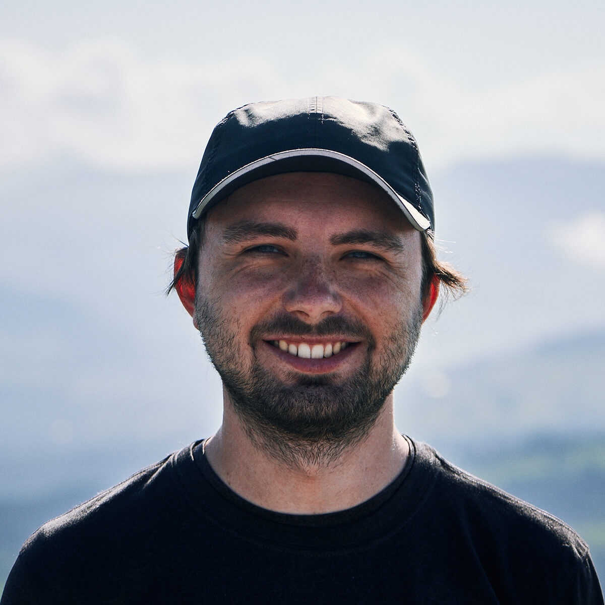

import { MDXLayout as PageLayout } from "../../components/blocks/mdx-layout";
import { SEO } from "../../components/seo";

<SEO
  title="About"
  description="A little bit about me and what I'm passionate about, what I do at work, and what else I do in my free time. Maybe you're also into photography or hiking?"
  noIndex
/>

export default PageLayout;

# About

**Hi, I'm Lennart 👋**  
I'm a designer turned software engineer from Darmstadt, Germany. I currently work at [Gatsby](https://www.gatsbyjs.com) on the open source software (OSS).
I'm passionate about working on open source projects & building thriving communities around them. 
My [OSS code](https://github.com/LekoArts) has been used by thousands of people & I regularly share educational content in the form of [posts](/writing), [presentations](/appearances), and [videos](/appearances).

## What I'm passionate about

Similarly to how I learned everything about [design, 3D art, and photography](/art) I'm a self-taught developer. Online developer communities, OSS projects, educators sharing their knowledge (for free & paid), mentors, colleagues, and friends -- all those people helped me get to where I am today. And I'm very grateful for that. Early on I also helped out people, contributed to OSS projects and published my own projects on GitHub. That's how I realized that I enjoy technical writing (e.g. public facing documentation), creating educational content and managing & interacting with communities. I deeply care about inclusivity & accessibility both in the communication with people and the content (e.g. website/documentation) itself.

## Work

I work at [Gatsby](https://www.gatsbyjs.com) maintaining & further improving the OSS project. Together with my colleagues I implement bug fixes, performance improvements, new features, and review issues & PRs to help >300k users build websites. I'm also managing our various community platforms (GitHub Discussion, Discord) and integrate processes to better engage with our community.

You can see my [projects](/projects) overview for more technical details.

## Hobbies

If I'm not coding I'd like to spend my time with playing tennis & hiking in the mountains. I then often take my camera with me to take [landscape photos](/art/photography) and also particularly enjoy editing the photos at the computer afterwards. I also enjoy creating other forms of [art](/art) such as 3D art or UI design. Lastly, my kindle is always filled with fantasy & sci-fi books 📚.
