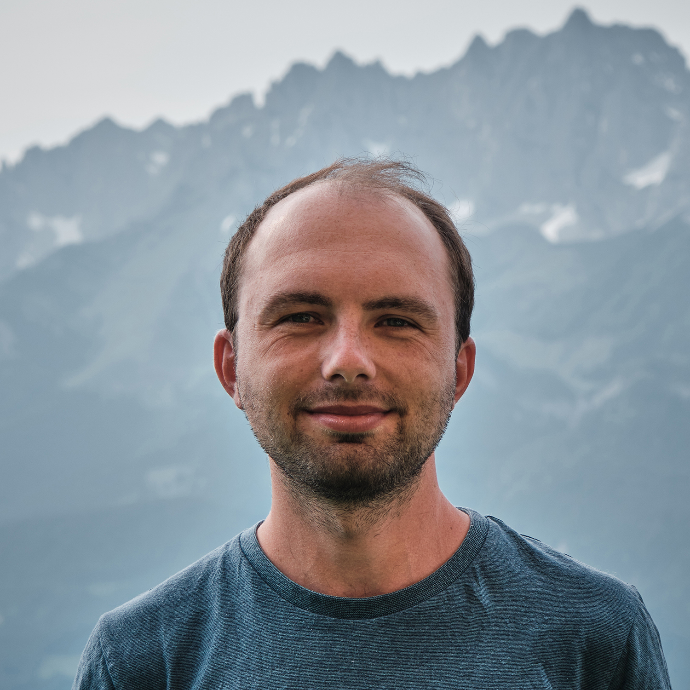

import { MDXLayout as PageLayout } from "../../components/blocks/mdx-layout"
import { SEO } from "../../components/seo"

export const Head = () => (
  <SEO
    title="About"
    description="A little bit about me and what I'm passionate about, what I do at work, and what else I do in my free time. Maybe you're also into photography or hiking?"
  />
)

export default PageLayout

# About

**Hi, I'm Lennart 👋**  
I'm a designer turned software engineer from Darmstadt, Germany.
I enjoy working on open source projects & making the web more inclusive through them. 
My [OSS code](https://github.com/LekoArts) has been used by thousands of people & I regularly share educational content in the form of [posts](/writing), [presentations](/appearances), and [videos](/appearances).

## What I'm passionate about

Similarly to how I learned everything about [design, 3D art, and photography](/art) I'm a self-taught developer. Online developer communities, OSS projects, educators sharing their knowledge (for free & paid), mentors, colleagues, and friends – all those people helped me get to where I am today. And I'm very grateful for that. Early on I also helped out people, contributed to OSS projects and published my own projects on GitHub. That's how I realized that I enjoy technical writing, creating educational content, and managing communities. I deeply care about inclusivity & accessibility both in those communities and the content created for them.

## Work

I'm currently looking for my next role so I've laid out [5 Reasons Why You Should Hire Me](/garden/5-reasons-why-you-should-hire-me). If you think I'd be a good fit for your team, please reach out through the contact details in my [resume](/resume).

### Previously

**Netlify**

Gatsby was acquired by Netlify and I continued to work as a Senior Software Engineer on the Gatsby framework. In addition to the previous work I also started to work on Netlify's runtimes to best support all major meta frameworks on Netlify.

**Gatsby**

I've joined Gatsby (now a Netlify company) in its early stages and saw this hyper-growth startup grow to 50+ people. During my 4 year tenure there I worked together with a lot of fantastic people that mentored me and allowed me to grow from a software engineer to a senior software engineer. Later I was able to mentor team members myself and lead projects across the whole organization.

Gatsby, as one of the major React meta frameworks, is used by millions of people and by many of the largest companies. I took the lead on organizing and managing many of the processes around the open source project and its communication. For example, I've established a robust RFC process and wrote extensive documentation. I was also responsible for implementing Gatsby's default file-based routing, robust hot reloading during development, contributing to a 40% decrease in build time using LMDB, and adding 100% TypeScript support to Gatsby. I've also lead the work on Partial Hydration which was the first beta implemtation of React Server Components in a major React meta framework.

## Hobbies

If I'm not coding I like to spend my time with playing tennis & hiking in the mountains. I then often take my camera with me to take [landscape photos](/art/photography) and also particularly enjoy editing the photos at the computer afterwards. I also enjoy creating other forms of [art](/art) such as 3D art or UI design. Lastly, my kindle is always filled with fantasy & sci-fi books 📚.

## Bio: Short version

Lennart is a designer turned software engineer who is passionate about working on open source projects & making the web more inclusive through them. In the past Lennart has worked on Gatsby and his own open source projects with a particular focus on DX and documentation. When away from the keyboard, Lennart can be found hiking in the mountains, doing landscape photography, or reading fantasy & sci-fi books.

[Download photo](https://www.lekoarts.de/social/head.jpg)
