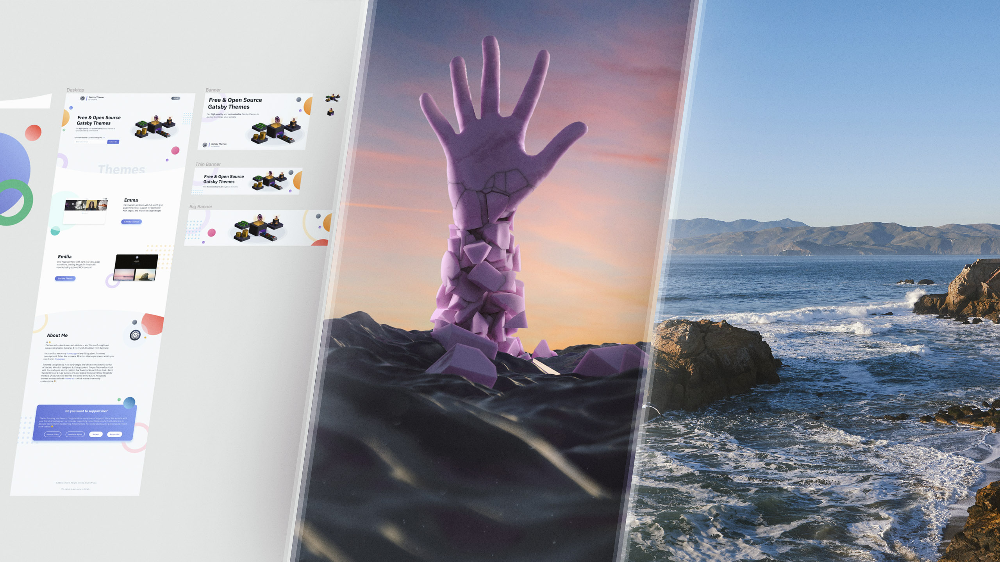

import { MDXLayout as PageLayout } from "../../components/blocks/mdx-layout";
import { SEO } from "../../components/seo";

<SEO title="Art" />

export default PageLayout;

# Art

Besides software development I have another huge passion of mine: Designing UI in Figma, creating photo manipulations in Photoshop, tinkering with abstract art in Cinema4D, and exploring nature & capturing it with my Fujifilm camera. Or in other words: _I enjoy art!_

I've started my journey in High School as I wanted to have custom signatures (little graphics under your post) in a couple of online forums. There was and still is a community of people doing these little _tags_ on [DeviantArt](https://www.deviantart.com/) and it was my entry to the world of using Photoshop. Like a sponge I absorbed every tutorial there was online and probably used it daily for a couple of years. Soon I began doing webdesign (in Photoshop, I know 😀) and photo manipulations -- the former for some extra money, the latter as it was more advanced and really challenged all my acquired skills. It's both difficult & rewarding blending multiple photos seamlessly together into a picture while telling a story via the image itself. Over the years I learned new tools and shifted some work out of Photoshop and e.g. to Figma. Nowadays I do UI design for all my own projects (it also helps for frontend development in my day job) and the rest as a hobby in my free time.

Under the [UI Design](/art/ui) category you'll primarily find webdesigns & related graphics made in Figma. The [3D Art](/art/3d) section features my favourite art made in various 3D software. Last but not least, the [Photography](/art/photography) page shows the photos (primarily landscapes) I'm most proud of!
